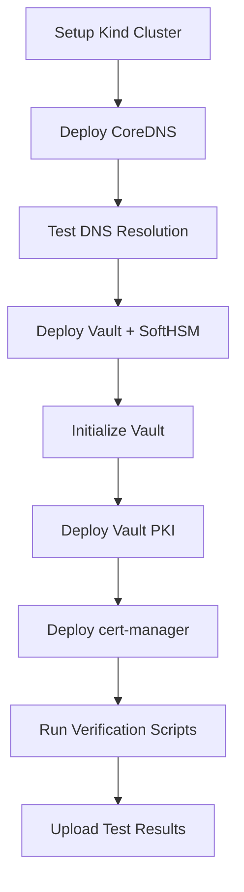

# GitHub Actions CI/CD Pipelines

Automated CI/CD pipelines for the AIOps Substrate project with comprehensive testing, security scanning, and SBOM generation.

## 📋 Overview

This directory contains three main workflows:

1. **`ci.yml`** - Main CI/CD pipeline with testing
2. **`security-scan.yml`** - Comprehensive security scanning
3. **`sbom.yml`** - Software Bill of Materials generation

## 🚀 Workflows

### 1. CI Pipeline (`ci.yml`)

**Triggers:**
- Push to any branch
- Pull requests to main/master
- Manual workflow dispatch

**Jobs:**

#### Linting and Validation
- Terraform format checking
- Terraform validation
- YAML linting (yamllint)
- Shell script linting (shellcheck)

#### Build Container Images
- Build AI Ops Agent Docker image
- Push to GitHub Container Registry (GHCR)
- Cache layers for faster builds
- Tag with branch, PR, SHA, and semantic versions

#### Test Foundation Services
Complete end-to-end testing of infrastructure:



**Key Features:**
- Creates ephemeral Kind cluster
- Deploys full foundation stack
- Tests DNS (cluster.local + corp.local)
- Verifies Vault PKI functionality
- Tests cert-manager integration
- Collects logs on failure

#### Integration Tests
- End-to-end stack deployment
- Certificate lifecycle testing
- Service interaction validation

**Artifacts:**
- Test results (retained for 7 days)
- Vault initialization keys
- Service logs

---

### 2. Security Scanning (`security-scan.yml`)

**Triggers:**
- Push to main/master
- Pull requests
- Daily at 2 AM UTC (scheduled)
- Manual workflow dispatch

**Jobs:**

#### Secret Scanning
- **TruffleHog**: Scans for leaked secrets and credentials
- **GitLeaks**: Additional secret detection

#### Container Vulnerability Scanning

**Trivy:**
- Container image scanning
- Filesystem scanning
- Configuration scanning
- Uploads SARIF to GitHub Security

**Grype:**
- Alternative vulnerability scanner
- JSON output for tracking
- Fail on HIGH severity

#### Kubernetes Security
- **Kubesec**: Scans K8s manifests for security issues

#### Infrastructure as Code
- **tfsec**: Terraform security scanning
- SARIF output for GitHub Security

#### Dependency Scanning
- **Safety**: Python dependency vulnerability scanning

#### Linting for Security
- ShellCheck for shell scripts
- YAML lint for configuration files

**Reports:**
- Security summary in GitHub Actions
- SARIF uploads to GitHub Security tab
- Artifact retention for 30 days

---

### 3. SBOM Generation (`sbom.yml`)

**Triggers:**
- Push to main/master
- Tags starting with 'v'
- Pull requests
- Release publications
- Manual workflow dispatch

**Jobs:**

#### Generate Container SBOM
Uses Syft to generate SBOMs in multiple formats:
- **CycloneDX JSON** (industry standard)
- **SPDX JSON** (Linux Foundation standard)
- **Syft JSON** (Anchore native format)
- **Table** (human-readable)

#### Generate Repository SBOM
- Scans entire repository for dependencies
- CycloneDX and SPDX formats

#### Sign Artifacts (Cosign)
**When:** Push to main or version tags

- Keyless signing with Sigstore
- Signs container images
- Signs SBOM files
- Attaches SBOM to container image
- Creates verification bundles

**Technology:** Uses Cosign with GitHub OIDC for keyless signing

#### Verify Signatures
- Verifies image signatures
- Verifies SBOM signatures
- Ensures supply chain integrity

#### SBOM Quality Check
- Uses `sbomqs` to score SBOM quality
- Validates JSON format
- Reports quality metrics

**Artifacts:**
- SBOMs (retained for 90 days)
- Signed SBOMs with bundles
- Quality reports

**Release Assets:**
- Automatically attaches SBOMs to GitHub releases

---

## 🔐 Security Features

### Supply Chain Security

1. **SBOM Generation**: Know what's in your containers
2. **Vulnerability Scanning**: Trivy + Grype for comprehensive coverage
3. **Image Signing**: Cosign keyless signing with Sigstore
4. **Secret Scanning**: Prevent credential leaks
5. **IaC Security**: Scan Terraform for misconfigurations

### GitHub Security Integration

- SARIF uploads to Security tab
- Dependency graph integration
- Security advisories
- Code scanning alerts

---

## 📊 Workflow Status

Check workflow status in your repository:

```bash
# View workflow runs
gh run list --workflow=ci.yml

# View security scan results
gh run list --workflow=security-scan.yml

# View SBOM generation
gh run list --workflow=sbom.yml
```

Or visit: `https://github.com/YOUR_USERNAME/suhlabs/actions`

---

## 🛠️ Local Testing

### Linting
```bash
# YAML lint
yamllint cluster/

# Shell check
shellcheck cluster/**/*.sh

# Terraform
terraform fmt -check -recursive infra/
```

### Build and Test Locally
```bash
# Build AI Ops Agent
docker build -t ai-ops-agent:local cluster/ai-ops-agent

# Generate SBOM locally
syft ai-ops-agent:local -o cyclonedx-json

# Scan for vulnerabilities
trivy image ai-ops-agent:local
grype ai-ops-agent:local
```

### Run Foundation Tests
```bash
# Create Kind cluster
kind create cluster --name test --config bootstrap/kind-cluster.yaml

# Run verification
cd cluster/foundation
./verify-all.sh
```

---

## 📋 Required Secrets

### GitHub Repository Secrets

None required for basic operation! The workflows use:
- `GITHUB_TOKEN` (automatically provided)
- OIDC for keyless signing (no secrets needed)

### Optional Secrets

- `GITLEAKS_LICENSE`: For GitLeaks Pro features

---

## 🎯 CI/CD Best Practices

### What We Implement

✅ **Automated Testing**: Every push runs full test suite
✅ **Security Scanning**: Multi-tool approach for comprehensive coverage
✅ **SBOM Generation**: Track all dependencies
✅ **Image Signing**: Cryptographic proof of authenticity
✅ **Fail Fast**: Early feedback on issues
✅ **Artifact Retention**: Keep results for analysis
✅ **Scheduled Scans**: Daily security checks
✅ **Branch Protection**: Ensure tests pass before merge

### Workflow Design Principles

1. **Parallelization**: Independent jobs run concurrently
2. **Caching**: Docker layer caching for faster builds
3. **Conditional Execution**: Skip unnecessary steps
4. **Artifact Management**: Retain important outputs
5. **Error Handling**: Collect logs on failure
6. **Summary Reports**: GitHub Step Summary for quick insights

---

## 📈 Performance

Typical workflow durations:

| Workflow | Duration | Frequency |
|----------|----------|-----------|
| CI Pipeline | ~8-12 minutes | Every push |
| Security Scan | ~5-8 minutes | Push to main, daily |
| SBOM Generation | ~3-5 minutes | Push to main, tags |

**Optimizations:**
- Docker BuildKit caching
- Parallel job execution
- Conditional job execution
- Artifact caching

---

## 🔧 Customization

### Add New Tests

Edit `.github/workflows/ci.yml`:

```yaml
- name: My Custom Test
  run: |
    cd my-service
    ./run-tests.sh
```

### Add Security Scanner

Edit `.github/workflows/security-scan.yml`:

```yaml
- name: Custom Security Scan
  run: |
    custom-scanner --config config.yml
```

### Modify SBOM Formats

Edit `.github/workflows/sbom.yml`:

```yaml
- name: Generate Custom SBOM
  run: |
    syft . --output custom-format --file sbom-custom.json
```

---

## 📚 References

- [GitHub Actions Documentation](https://docs.github.com/en/actions)
- [Trivy](https://aquasecurity.github.io/trivy/)
- [Grype](https://github.com/anchore/grype)
- [Syft](https://github.com/anchore/syft)
- [Cosign](https://docs.sigstore.dev/cosign/overview/)
- [tfsec](https://aquasecurity.github.io/tfsec/)
- [Kubesec](https://kubesec.io/)

---

## 🐛 Troubleshooting

### Workflow Fails to Start

**Issue:** Workflow doesn't trigger on push

**Solution:**
```bash
# Check workflow syntax
yamllint .github/workflows/ci.yml

# Verify workflow is enabled
gh workflow list
gh workflow enable ci.yml
```

### Build Failures

**Issue:** Docker build fails in CI

**Solution:**
1. Check Dockerfile syntax locally
2. Verify all required files exist
3. Test build locally: `docker build cluster/ai-ops-agent`

### Test Failures

**Issue:** Foundation tests fail

**Solution:**
1. Check test logs in Actions UI
2. Verify deploy scripts have execute permission
3. Test locally with Kind cluster

### Security Scan False Positives

**Issue:** Vulnerability scanner reports non-issues

**Solution:**
1. Add exceptions to scanner config
2. Use `.trivyignore` or `.grypeignore`
3. Adjust severity thresholds

---

## 📝 Changelog

### v1.0.0 (Day 6)
- Initial CI/CD pipeline implementation
- Foundation service testing
- Security scanning with Trivy, Grype, tfsec, Kubesec
- SBOM generation with Syft
- Image signing with Cosign
- Automated linting and validation

---

**Status**: Day 6 - CI/CD Pipeline Implementation Complete

**Next Steps**: Enable branch protection rules to require CI passing before merge
