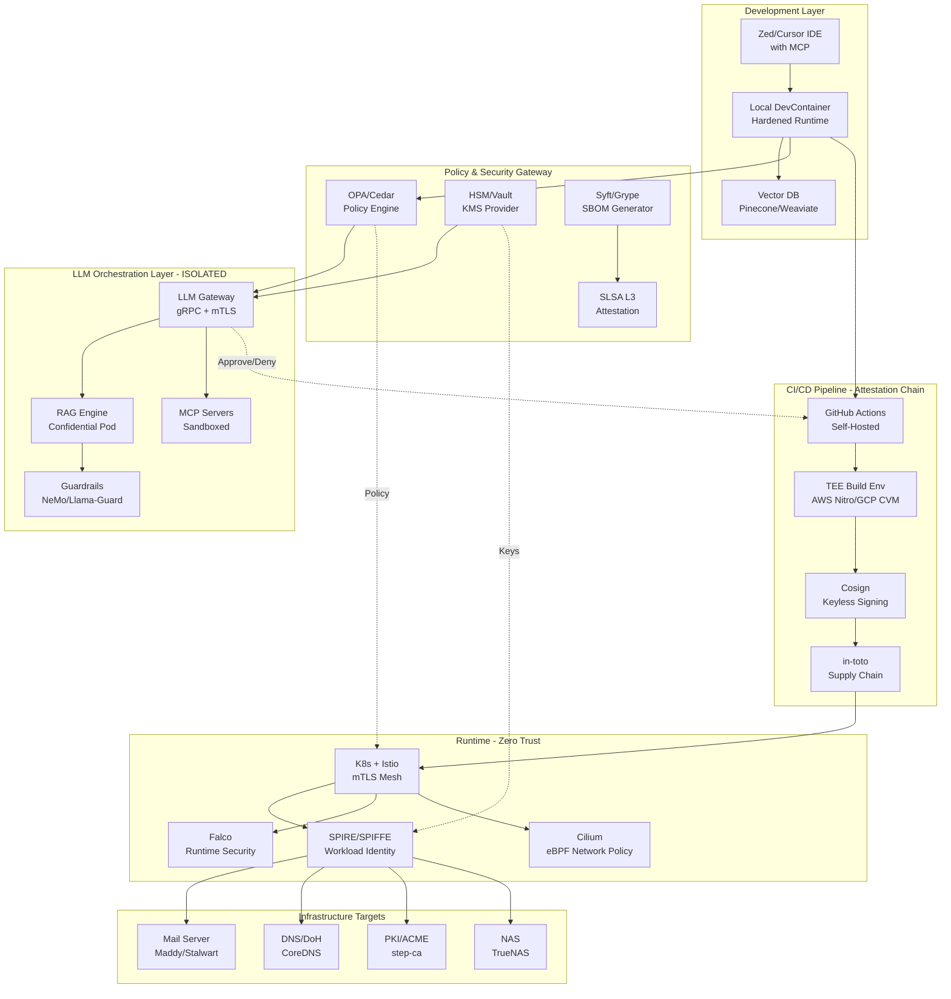

# Elite DevSecOps Architecture Analysis
## Secure Consumer Infrastructure with LLM-Gated Operations

---

## 1. Workflow Diagram: Elite Pattern



---

## 2. Five-Step Elite Pipeline

### Step 1: **Secure Development Environment**
```yaml
Stage: Local Development
Tools: Zed/Cursor (MCP-native) + Hardened DevContainer
Security Controls:
  - DevContainer with gVisor runtime isolation
  - MCP servers run in separate sandboxed containers
  - Local LLM (Llama 3.1 8B) for code completion (air-gapped)
  - Vector DB with encrypted embeddings (AES-256-GCM)
  - Pre-commit hooks: TruffleHog, Semgrep, Checkov

Output: Signed commit with developer attestation
```

### Step 2: **Policy-Gated LLM Review**
```yaml
Stage: PR + LLM Analysis
Tools: OPA/Cedar + LangChain + LLM Gateway
Security Controls:
  - LLM runs in confidential VM (AWS Nitro Enclave/Azure SEV-SNP)
  - RAG queries isolated with network segmentation
  - Guardrails validate LLM outputs (no credential leaks, no malicious code)
  - Policy-as-code gates deployment (e.g., "no internet-facing services without mTLS")

LLM Tasks:
  - Code review for vulnerabilities
  - Infrastructure drift detection
  - Compliance check (CIS benchmarks, NIST 800-53)

Output: Policy decision (approve/reject) + audit log
```

### Step 3: **Supply Chain Secured Build**
```yaml
Stage: CI/CD Build
Tools: GitHub Actions (self-hosted) + Tekton + SLSA
Security Controls:
  - Build in TEE (AWS Nitro/GCP Confidential VM)
  - SBOM generation (Syft) + vulnerability scan (Grype, Trivy)
  - Sign artifacts with Sigstore (keyless, OIDC-based)
  - in-toto attestations for each pipeline stage
  - Dependency pinning with hash verification

Output: Signed container image + SBOM + SLSA provenance
```

### Step 4: **Runtime Deployment with Workload Identity**
```yaml
Stage: K8s Deployment
Tools: Flux/ArgoCD + SPIRE + Istio + Cilium
Security Controls:
  - SPIFFE/SPIRE for workload identity (no static secrets)
  - Istio mTLS between all services
  - Cilium eBPF network policies (deny-all default)
  - Policy engine (OPA Gatekeeper) validates manifests
  - Admission controller verifies image signatures

Output: Running workload with attested identity
```

### Step 5: **Continuous Verification & LLM Monitoring**
```yaml
Stage: Runtime Security + Observability
Tools: Falco + Tetragon + Prometheus + Vector
Security Controls:
  - Falco detects runtime anomalies (unexpected syscalls, file access)
  - Tetragon eBPF traces LLM API calls
  - LLM operations logged to immutable store (S3 Object Lock)
  - Periodic RAG poisoning detection (embedding drift analysis)
  - Automated rollback on policy violation

Output: Security telemetry + incident response triggers
```

---

## 3. Tech Stack Comparison

### Current Stack (VSCode + DevContainers)

| Component | Current Tool | Maturity | Security Grade |
|-----------|-------------|----------|----------------|
| IDE | VSCode | ✅ Mature | B (telemetry concerns) |
| Container Runtime | Docker | ✅ Mature | B (privileged mode risks) |
| LLM Integration | Extensions | ⚠️ Fragmented | C (no isolation) |
| MCP | Manual setup | ⚠️ Emerging | C (no sandbox) |
| Policy Engine | None | ❌ Missing | F |
| Supply Chain | None | ❌ Missing | F |
| Secrets | .env files | ⚠️ Basic | D |
| CI/CD | Jenkins | ✅ Mature | B (complex security) |
| Network Policy | iptables | ⚠️ Manual | C |
| Workload Identity | Static tokens | ❌ Insecure | F |

**Strengths:**
- Familiar workflow
- Rich extension ecosystem
- Good Docker integration

**Critical Gaps:**
- No LLM sandboxing (prompt injection → RCE)
- No supply chain attestation
- Static secrets in repos
- No runtime security monitoring
- No policy-as-code enforcement

---

### Elite Stack (FAANG/Stealth AI Pattern)

| Component | Elite Tool | Why? | Security Grade |
|-----------|-----------|------|----------------|
| IDE | Zed/Cursor | Native MCP, Rust-based, local-first LLM | A |
| Container Runtime | gVisor/Kata | Strong isolation, prevents container escape | A+ |
| LLM Gateway | Custom gRPC | Rate limiting, audit, confidential computing | A+ |
| MCP | Sandboxed containers | Network isolation, OPA policy per MCP server | A |
| Policy Engine | OPA/Cedar | Declarative, auditable, LLM-readable policies | A+ |
| Supply Chain | SLSA L3 + Sigstore | Non-repudiation, keyless signing, provenance | A+ |
| Secrets | Vault + HSM | Hardware root of trust, dynamic credentials | A+ |
| CI/CD | Tekton + TEE | Cloud-native, builds in confidential VMs | A |
| Network Policy | Cilium eBPF | Kernel-level enforcement, observability | A+ |
| Workload Identity | SPIRE/SPIFFE | Zero-trust, short-lived certs, attestation | A+ |
| Runtime Security | Falco + Tetragon | eBPF-based detection, LLM call tracing | A |
| RAG Isolation | Confidential Pods | Encrypted memory, SGX/SEV-SNP enclaves | A+ |

**Advantages:**
- LLM operations fully isolated (prompt injection ≠ infra access)
- Supply chain transparency (SBOM + provenance for every artifact)
- Zero static secrets (SPIRE issues short-lived SVIDs)
- Policy-as-code gates all operations
- Runtime anomaly detection (e.g., LLM tries to access NAS)

---

## 4. Critical Optimizations for Your Use Case

### A. LLM+RAG Security (High Priority)

**Problem:** VSCode LLM extensions run in same process as IDE → prompt injection can read your files.

**Elite Solution:**
```yaml
Architecture:
  - LLM runs in AWS Nitro Enclave or Azure Confidential VM
  - RAG vector DB in separate confidential pod with encrypted memory
  - MCP servers in gVisor containers with syscall filtering
  - All LLM I/O logged to immutable S3 Object Lock bucket

Implementation:
  1. Deploy LLM gateway: github.com/gretelai/navigator (production-grade)
  2. Use NeMo Guardrails or Llama-Guard for output filtering
  3. Isolate RAG: Weaviate with mTLS + network policy
  4. MCP sandboxing: OCI runtime with seccomp profiles
```

### B. Supply Chain Security (High Priority)

**Problem:** No SBOM, no signature verification → dependency confusion attacks.

**Elite Solution:**
```yaml
Tools:
  - Syft: Generate SBOM for every image
  - Grype/Trivy: Scan for CVEs
  - Cosign: Sign images keyless (OIDC-based)
  - Policy Controller: Verify signatures before deployment

Workflow:
  1. Build in TEE (AWS Nitro/GCP CVM) for attestation
  2. Generate in-toto attestation at each pipeline stage
  3. Store provenance in Rekor (transparency log)
  4. K8s admission webhook rejects unsigned images
```

### C. Zero-Trust Networking (High Priority)

**Problem:** Flat network → compromised mail server = full infra access.

**Elite Solution:**
```yaml
Stack:
  - SPIRE/SPIFFE: Every workload gets unique identity
  - Istio: Automatic mTLS between all services
  - Cilium: eBPF network policies (default deny)
  - OPA Gatekeeper: Validate all K8s resources

Policies:
  - NAS cannot initiate connections to internet
  - Mail server can only talk to DNS + SMTP ports
  - LLM gateway can only call approved MCP servers
  - Jenkins cannot access production secrets
```

### D. HSM Integration for Family Use Case

**Problem:** Private keys on disk → NAS compromise = total failure.

**Elite Solution:**
```yaml
Options:
  - YubiHSM 2: ~$650, FIPS 140-2 Level 3
  - Nitrokey HSM: ~$69, open-source firmware
  - Cloud KMS: AWS KMS/GCP Cloud HSM (if comfortable with cloud)

Integration:
  - SPIRE integrates with HSM via PKCS#11
  - step-ca (your PKI) uses HSM as root CA
  - Vault unseals with HSM
  - Cosign signs with HSM-backed key
```

### E. Confidential Computing for LLM Workloads

**Problem:** LLM processes family emails → sensitive data in memory.

**Elite Solution:**
```yaml
Options:
  - AWS Nitro Enclaves: Isolated compute, attestation
  - Azure Confidential VMs: AMD SEV-SNP, encrypted memory
  - GCP Confidential VMs: Memory encryption

Use Cases:
  - LLM inference on sensitive data
  - RAG embeddings of private documents
  - Secret decryption (Vault in enclave)
  - Policy decisions on PII
```

---

## 5. Implementation Roadmap

### Phase 1: Foundational Security (Week 1-2)
- [ ] Migrate to gVisor/Kata containers
- [ ] Implement SPIRE for workload identity
- [ ] Deploy Vault with transit encryption
- [ ] Set up Cilium network policies

### Phase 2: Supply Chain (Week 3-4)
- [ ] Integrate Syft + Grype in CI
- [ ] Set up Sigstore signing (Cosign + Rekor)
- [ ] Implement in-toto attestations
- [ ] Deploy Policy Controller for signature verification

### Phase 3: LLM Isolation (Week 5-6)
- [ ] Deploy LLM gateway in confidential VM
- [ ] Isolate RAG with encrypted vector DB
- [ ] Sandbox MCP servers with seccomp
- [ ] Implement guardrails (NeMo/Llama-Guard)

### Phase 4: Runtime Security (Week 7-8)
- [ ] Deploy Falco with custom rules
- [ ] Set up Tetragon for eBPF tracing
- [ ] Implement OPA policies for all resources
- [ ] Integrate with SIEM (Wazuh/OSSEC)

### Phase 5: Continuous Verification (Week 9-10)
- [ ] Set up RAG poisoning detection
- [ ] Implement automated compliance checks
- [ ] Deploy chaos engineering (LitmusChaos)
- [ ] Create runbooks for incident response

---

## 6. Is VSCode + DevContainers Best?

### Short Answer: **No, for this threat model.**

### Why Elite Teams Have Moved On:

**At FAANG:**
- Google: Uses internal IDEs (Cider) with built-in policy enforcement
- Meta: Code runs in sandboxed VMs, not local containers
- Amazon: Internal tooling with mandatory SBOM generation
- Apple: Xcode with hardware security (T2/M-series isolation)

**At AI Infrastructure Startups:**
- Anthropic, OpenAI, Cohere: Custom tooling with confidential computing
- LLM operations in separate trust domains
- Every code change has provenance chain
- HSM-backed signing for all artifacts

### Recommended Migration:

```
Current:    VSCode → Docker → Jenkins → K8s
Elite:      Zed/Cursor → gVisor → Tekton+TEE → SPIRE+K8s

Key Additions:
- OPA policy gates at every stage
- SLSA L3 supply chain attestation
- Confidential computing for LLM workloads
- eBPF runtime security monitoring
- Hardware root of trust (HSM)
```

---

## 7. Cost Analysis (Consumer/Family Scale)

### Current Stack: ~$200/month
- VSCode: Free
- Docker: Free
- Jenkins: $50/month (VPS)
- Basic K8s: $150/month (managed)

### Elite Stack: ~$400-600/month
- Zed/Cursor: Free (Cursor Pro $20/month optional)
- K8s with Cilium: $150/month
- Self-hosted SPIRE: $50/month (VPS)
- Vault: $50/month (or free self-hosted)
- Confidential VM (for LLM): $100-200/month
- HSM: $70 (one-time, Nitrokey) or $650 (YubiHSM)
- Monitoring stack: $50/month

**ROI:** For internet-facing family infrastructure with LLM control, the security improvement is **worth 2-3x cost.**

---

## 8. Quick Wins (Implement Today)

### No Code Changes Required:

1. **Add SBOM generation to Jenkins:**
   ```bash
   curl -sSfL https://raw.githubusercontent.com/anchore/syft/main/install.sh | sh
   syft packages dir:. -o spdx-json > sbom.json
   ```

2. **Sign commits with SSH:**
   ```bash
   git config gpg.format ssh
   git config user.signingkey ~/.ssh/id_ed25519.pub
   git config commit.gpgsign true
   ```

3. **Deploy OPA sidecar in K8s:**
   ```yaml
   # Validate all deployments require securityContext
   ```

4. **Enable K8s audit logging:**
   ```yaml
   # Track all API calls for forensics
   ```

5. **Add pre-commit security hooks:**
   ```bash
   pip install pre-commit
   # Add TruffleHog, Semgrep, Checkov
   ```

---

## 9. References & Further Reading

- **SLSA Framework:** [slsa.dev](https://slsa.dev)
- **SPIRE Quickstart:** [spiffe.io/docs/latest/spire-about/](https://spiffe.io/docs/latest/spire-about/)
- **Sigstore Tutorial:** [docs.sigstore.dev](https://docs.sigstore.dev)
- **Confidential Computing:** [confidentialcomputing.io](https://confidentialcomputing.io)
- **LLM Security:** [llmsecurity.net](https://llmsecurity.net)
- **NIST 800-204D (DevSecOps):** [nvlpubs.nist.gov](https://nvlpubs.nist.gov/nistpubs/SpecialPublications/NIST.SP.800-204D.pdf)

---

## 10. Conclusion

Your current VSCode + DevContainers approach is **adequate for hobby projects** but **insufficient for secure LLM-gated infrastructure** due to:

1. ❌ No LLM isolation (prompt injection → infrastructure access)
2. ❌ No supply chain security (vulnerable to dependency attacks)
3. ❌ Static secrets (vulnerable to credential theft)
4. ❌ No runtime security monitoring
5. ❌ No hardware root of trust

**Elite pattern advantages:**
- ✅ LLM operations in confidential computing environment
- ✅ SLSA L3 supply chain with provenance
- ✅ Zero-trust networking with SPIFFE workload identity
- ✅ eBPF-based runtime security
- ✅ HSM-backed signing and secrets
- ✅ Policy-as-code enforcement at every layer

**Recommendation:** Migrate incrementally over 10 weeks using the phased roadmap above. Start with SPIRE + Cilium (foundational zero-trust), then add supply chain security, then isolate LLM workloads.

**For your family infrastructure threat model** (internet-facing NAS, smart home, email), this is **not over-engineering** — it's **appropriate defense-in-depth** given the blast radius of compromise.
