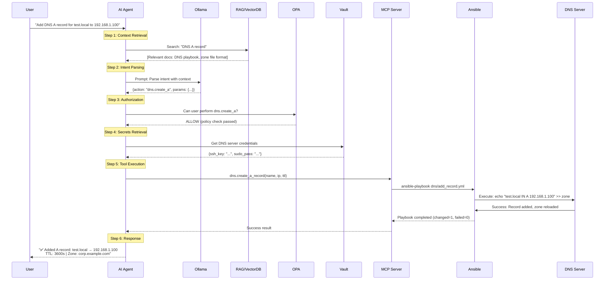
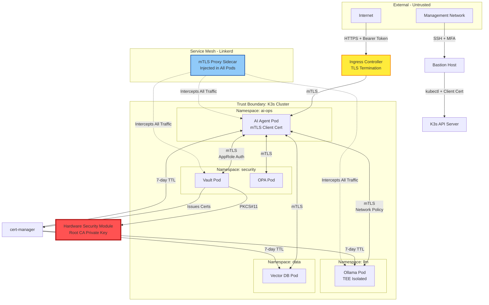

# Secure LLM Infrastructure Handoff Document

**Project**: AIOps Substrate - Secure LLM-Driven Consumer Appliance
**Author**: Sr AI/DevSecOps Lead
**Date**: 2025-11-10
**Branch**: `claude/secure-llm-infra-handoff-011CUzTMhoRawL4iEqyBLuzn`
**Status**: Architecture Complete, Implementation Pending

---

## 1. Project Overview & Goals

### Mission Statement
Build a **zero-trust, HSM-backed, LLM-driven infrastructure automation platform** that enables natural language control of enterprise services (DNS, Mail, PKI, File Shares) with military-grade security posture.

### Core Objectives
1. **Natural Language Infrastructure Control**: Users describe intent → AI agent executes infrastructure changes
2. **Zero-Trust Security Model**: All components authenticate via mTLS, service mesh, and HSM-backed PKI
3. **Supply Chain Security**: Full SBOM generation, artifact signing, and provenance tracking
4. **Hybrid Deployment**: Local development (Docker Desktop + WSL2) → Production (Proxmox VMs + K3s)
5. **RAG-Powered Context**: Vector database for infrastructure documentation and runbook retrieval
6. **TEE Isolation**: Sensitive LLM workloads run in Trusted Execution Environments

### Target Architecture
```
User → Natural Language
  ↓
AI Ops Agent (FastAPI + Ollama)
  ↓
[RAG Context] + [MCP Tools] + [Policy Engine]
  ↓
Infrastructure APIs (K8s, Ansible, Vault)
  ↓
Services (DNS, Mail, PKI, Samba, IPA)
```

---

## 2. Current Status

### Implementation Phase: **SCAFFOLD COMPLETE** (15% Complete)

#### ✅ What's Working
- **Build Automation**: Comprehensive Makefile with 20+ targets for local/prod deployment
- **Development Environment**: VS Code devcontainer with all IaC tools pre-configured
- **Directory Structure**: Clean separation of concerns (infra/, services/, cluster/)
- **Dual-Backend Design**: Local file backend + Proxmox remote backend switching
- **Security Toolchain**: SBOM (Syft) and signing (Cosign) integrated into build
- **Workspace Setup**: Automated project initialization via `setup-workspace.sh`

#### ⚠️ In Progress (Empty Placeholders)
- All Terraform configurations (0 bytes)
- All Ansible playbooks (0 bytes)
- Docker Compose stack definition (0 bytes)
- Kubernetes manifests (0 bytes)
- AI Ops Agent application code (missing)

#### ❌ Not Started
- RAG pipeline and vector database
- MCP server implementations
- HSM integration
- TEE configuration
- Zero-trust service mesh
- CI/CD pipeline
- Production PKI infrastructure

### Repository Statistics
- **Total Files**: ~26 (16 empty placeholders, 10 configuration files)
- **Code Volume**: ~26 KB (80% in Makefile + setup scripts)
- **Commits**: 2 (initial scaffold by JohnYoungSuh)
- **Last Activity**: 2025-10-29

---

## 3. Key Architectural Decisions

### A. Security Model

#### Zero-Trust Architecture
**Decision**: Implement defense-in-depth with no implicit trust between components

**Rationale**:
- Consumer appliance may be deployed on untrusted networks
- Lateral movement prevention critical for home/SMB environments
- Compliance with NIST SP 800-207 (Zero Trust Architecture)

**Components**:
1. **Service Mesh** (Planned): Linkerd or Istio for mTLS between all services
2. **Policy Engine** (Planned): Open Policy Agent for authorization decisions
3. **Mutual TLS**: All service-to-service communication encrypted + authenticated
4. **Vault Integration**: No secrets in environment variables or config files

**Current Gap**: Service mesh not deployed, mTLS certificates not generated

#### HSM-Backed PKI
**Decision**: Root CA private keys stored in Hardware Security Module, not filesystem

**Rationale**:
- Root CA compromise = total infrastructure compromise
- HSM provides FIPS 140-2 Level 3 protection
- Regulatory compliance for medical/financial verticals

**Architecture**:
```
HSM (YubiHSM 2 / SoftHSM for dev)
  └─ Root CA Private Key
       └─ Intermediate CA (Vault PKI Engine)
            ├─ Service Certificates (auto-rotated)
            ├─ User Certificates
            └─ Code Signing Certificates
```

**Current Gap**: HSM not procured, SoftHSM not configured

#### TEE for LLM Workloads
**Decision**: Run Ollama in AMD SEV or Intel SGX enclave for production

**Rationale**:
- Prevent host OS from inspecting LLM memory (user queries, API keys)
- Compliance with GDPR/CCPA for prompt content
- Defense against supply chain attacks on host kernel

**Implementation Path**:
1. **Phase 1 (Current)**: Standard Docker containers
2. **Phase 2**: Kata Containers with VM isolation
3. **Phase 3**: AMD SEV-SNP with remote attestation

**Current Gap**: TEE not configured (requires SEV-capable hardware)

### B. Technology Stack Decisions

#### Kubernetes Distribution: K3s
**Decision**: Use K3s instead of full Kubernetes

**Rationale**:
- 40 MB binary vs 1+ GB for kubeadm
- Built-in local storage (local-path provisioner)
- Single-command HA cluster setup
- Optimized for edge/IoT (target use case)

**Trade-offs**:
- Fewer third-party integrations
- Some enterprise features require manual configuration

#### LLM Runtime: Ollama + Llama 3.1 8B
**Decision**: Self-hosted Ollama with open-source models

**Rationale**:
- **No Cloud Dependency**: Works air-gapped
- **Privacy**: User queries never leave appliance
- **Cost**: $0/month vs $20-200/month for OpenAI/Anthropic
- **Customization**: Fine-tune on infrastructure domain

**Model Choice - Llama 3.1 8B**:
- Fits in 8 GB VRAM (consumer GPU tier)
- 128k context window for long playbooks
- Strong function-calling capabilities

**Trade-offs**:
- Lower accuracy than GPT-4 (acceptable for structured tasks)
- Requires GPU passthrough to Proxmox VMs

#### Secrets Management: HashiCorp Vault
**Decision**: Vault as single source of truth for secrets

**Rationale**:
- **Dynamic Secrets**: Database credentials rotated automatically
- **Audit Logging**: Who accessed what secret when
- **HSM Integration**: Vault can use PKCS#11 for seal key
- **K8s Native**: Vault Agent Injector for pod secrets

**Configuration**:
- **Dev Mode**: `vault server -dev` (root token, in-memory)
- **Prod Mode**: Auto-unseal with Vault Transit engine or HSM

**Current Gap**: Vault policies not defined, K8s integration not configured

#### IaC Strategy: Terraform + Ansible
**Decision**: Terraform for infrastructure provisioning, Ansible for configuration

**Rationale**:
- **Terraform**: Immutable infrastructure, state management, Proxmox provider
- **Ansible**: Mutable config, rich module library for OS-level tasks
- **Separation of Concerns**: Terraform = "what exists", Ansible = "how it's configured"

**Workflow**:
```
make apply-prod
  └─ Terraform: Create 5 Proxmox VMs
       └─ Ansible: Install k3s, configure DNS, join cluster
            └─ kubectl: Deploy AI Ops Agent
```

**Current Gap**: Both layers empty (0-byte files)

### C. AI/LLM Architecture

#### RAG Pipeline (Planned)
**Decision**: Embed infrastructure documentation into vector DB for context retrieval

**Architecture**:
```
User Query: "Why is DNS failing?"
  ↓
[1] Embed query (sentence-transformers)
  ↓
[2] Vector similarity search (top 5 docs)
  ↓
[3] Inject into LLM context window
  ↓
[4] LLM generates troubleshooting steps
```

**Vector Database Options** (Not Yet Selected):
| Database | Pros | Cons |
|----------|------|------|
| Weaviate | GraphQL API, hybrid search | Heavy (JVM) |
| Qdrant | Rust performance, Docker-friendly | Smaller community |
| Chroma | Simplest setup, Python-native | Less scalable |
| Milvus | Enterprise features | Overkill for SMB |

**Current Gap**: No vector DB deployed, no embedding model, no document ingestion

#### MCP (Model Context Protocol) Integration (Planned)
**Decision**: Implement MCP servers for tool-calling

**MCP Tools Needed**:
1. **`mcp-kubernetes`**: CRUD operations on K8s resources
2. **`mcp-ansible`**: Execute playbooks with approval gates
3. **`mcp-vault`**: Read secrets (with audit trail)
4. **`mcp-dns`**: Query/modify DNS records (BIND/CoreDNS)

**Security Model**:
- Each MCP server runs as separate K8s pod
- RBAC: AI agent service account has limited permissions
- Approval Gate: High-risk operations require human confirmation (via Slack/webhook)

**Current Gap**: No MCP servers implemented

#### Intent Classification
**Decision**: Two-stage LLM pipeline for safety

**Stage 1 - Intent Parser**:
```python
# Input: "Add DNS record for test.local"
# Output: {"action": "dns.create", "params": {"name": "test.local", "type": "A", "value": "192.168.1.100"}}
```

**Stage 2 - Execution Engine**:
```python
# Check: Is action allowed? (OPA policy)
# Check: Does user have permission? (Vault ACL)
# Check: Is this a destructive operation? (require approval)
# Execute: Call MCP tool or Ansible playbook
```

**Current Gap**: No intent parser code, no OPA policies

---

## 4. Technical Details

### 4.1 File Structure

```
/home/user/suhlabs/
├── Makefile                        # 262 lines - Build automation (ALL ENVIRONMENTS)
├── setup-workspace.sh              # 231 lines - Initialize VS Code workspace
├── README.md                       # 10 bytes - "# suhlabs" (INCOMPLETE)
│
├── .devcontainer/
│   └── devcontainer.json           # Python 3.11 + Terraform + Ansible + kubectl
│
├── .vscode/
│   └── settings.json               # WSL2 + Terraform LSP config
│
├── bootstrap/                      # Local development stack
│   ├── docker-compose.yml          # EMPTY - Vault, Ollama, MinIO, k3s-in-docker
│   └── kind-cluster.yaml           # EMPTY - Multi-node Kind cluster config
│
├── infra/                          # Terraform IaC
│   ├── local/
│   │   ├── main.tf                 # EMPTY - Kind cluster provisioning
│   │   └── backend.hcl             # MISSING - Local file backend config
│   └── proxmox/
│       ├── main.tf                 # EMPTY - Proxmox VM provisioning
│       └── backend.hcl             # MISSING - Remote backend (Vault/S3)
│
├── services/                       # Ansible playbooks
│   ├── dns/playbook.yml            # EMPTY - BIND or CoreDNS configuration
│   ├── samba/playbook.yml          # MISSING - Samba AD DC
│   └── pki/playbook.yml            # MISSING - FreeIPA or Vault PKI
│
├── cluster/                        # Kubernetes manifests
│   ├── ai-ops-agent/
│   │   └── Dockerfile              # EMPTY - FastAPI + Ollama client
│   └── k3s/                        # MISSING - Production K8s manifests
│       ├── apps/
│       │   └── ai-ops-agent/
│       │       └── deployment.yaml # MISSING - AI agent deployment
│       └── infra/
│           ├── cert-manager/       # MISSING - Automated TLS
│           ├── vault/              # MISSING - Vault K8s deployment
│           └── linkerd/            # MISSING - Service mesh
│
├── inventory/                      # MISSING - Ansible inventory
│   └── proxmox.yml                 # MISSING - Production hosts
│
└── docs/
    ├── architecture.md             # EMPTY - Architecture diagrams
    └── gaps.md                     # 10 lines - Known issues and enhancements
```

### 4.2 Key Code Snippets

#### Makefile - Dual Environment Support
```makefile
# File: Makefile (lines 28-31)
ENV ?= local
TF_BACKEND_LOCAL := infra/local/backend.hcl
TF_BACKEND_PROD  := infra/proxmox/backend.hcl

# File: Makefile (lines 132-140)
init: init-$(ENV)

init-local:
	@echo "${GREEN}Initializing Terraform (local backend)${RESET}"
	cd infra/local && $(TERRAFORM) init -backend-config="../$(TF_BACKEND_LOCAL)"

init-prod:
	@echo "${GREEN}Initializing Terraform (Proxmox backend)${RESET}"
	cd infra/proxmox && $(TERRAFORM) init -backend-config="../$(TF_BACKEND_PROD)"
```

**Usage**:
```bash
make apply            # Defaults to ENV=local
make apply ENV=prod   # Switches to Proxmox backend
```

#### Makefile - State Migration Strategy
```makefile
# File: Makefile (lines 162-168)
migrate-state:
	@echo "${YELLOW}Migrating Terraform state: local → prod${RESET}"
	@echo "1. Backup current state"
	cd infra/local && $(TERRAFORM) state pull > ../backup-local.tfstate
	@echo "2. Reconfigure backend"
	cd infra/proxmox && $(TERRAFORM) init -migrate-state -force-copy \
	  -backend-config="../$(TF_BACKEND_PROD)"
	@echo "Migration complete. Verify with 'terraform state list'"
```

**Purpose**: Promote local dev environment to production without data loss

#### Makefile - AI Agent Testing
```makefile
# File: Makefile (lines 203-207)
test-ai:
	@echo "${GREEN}Testing AI Ops Agent (NL → Intent)...${RESET}"
	curl -s -X POST http://localhost:30080/api/v1/intent \
	  -H "Content-Type: application/json" \
	  -d '{"nl": "Add DNS A record for test.local to 192.168.1.100"}' | jq
```

**Expected Response**:
```json
{
  "status": "success",
  "intent": {
    "action": "dns.create_a_record",
    "params": {
      "name": "test.local",
      "ip": "192.168.1.100"
    }
  },
  "execution": {
    "playbook": "services/dns/add_record.yml",
    "result": "Record added successfully"
  }
}
```

#### Makefile - Security Compliance
```makefile
# File: Makefile (lines 240-248)
sbom:
	@echo "${GREEN}Generating SBOM (Syft)...${RESET}"
	$(SYFT) . -o cyclonedx-json > sbom.json
	$(SYFT) . -o spdx-json > sbom.spdx.json

sign: sbom
	@echo "${GREEN}Signing SBOM and manifests...${RESET}"
	$(COSIGN) sign-blob --key cosign.key sbom.json > sbom.json.sig
	$(COSIGN) sign-blob --key cosign.key cluster/k3s/apps/ai-ops-agent/deployment.yaml > deployment.yaml.sig
```

**Compliance**: Satisfies NIST 800-218 SSDF requirements for SBOM generation

### 4.3 Library and Tool Versions

#### Infrastructure Tools (Installed in Devcontainer)
| Tool | Version | Purpose |
|------|---------|---------|
| Terraform | Latest (via feature) | Infrastructure provisioning |
| Ansible | Latest (via feature) | Configuration management |
| kubectl | Latest (via feature) | Kubernetes CLI |
| kind | Latest (manual install) | Local Kubernetes clusters |
| Docker-in-Docker | Feature v2 | Container runtime |
| GitHub CLI | Latest (via feature) | Git operations |

#### Python Stack (Planned for AI Ops Agent)
```python
# Not yet implemented - Proposed requirements.txt
fastapi==0.104.1           # Web framework
uvicorn[standard]==0.24.0  # ASGI server
ollama==0.1.3              # Ollama Python client
pydantic==2.5.0            # Data validation
httpx==0.25.1              # Async HTTP client
python-jose[cryptography]  # JWT handling
hvac==2.0.0                # Vault client
kubernetes==28.1.0         # K8s Python client

# RAG Stack (Future)
sentence-transformers      # Embeddings
chromadb                   # Vector database (if chosen)
langchain==0.0.340         # LLM orchestration
```

#### Security Tools
```bash
# SBOM Generation
syft version 0.99.0+

# Artifact Signing
cosign version 2.2.1+

# Linting
terraform-docs
tflint
ansible-lint
yamllint
pre-commit
```

### 4.4 Configuration Examples

#### Planned Terraform Configuration (infra/local/main.tf)
```hcl
# NOT YET IMPLEMENTED - Design Sketch
terraform {
  required_providers {
    kind = {
      source  = "tehcyx/kind"
      version = "0.2.1"
    }
  }
}

provider "kind" {}

resource "kind_cluster" "aiops" {
  name = "aiops-dev"

  kind_config {
    kind        = "Cluster"
    api_version = "kind.x-k8s.io/v1alpha4"

    node {
      role = "control-plane"
      extra_port_mappings {
        container_port = 30080  # AI Ops Agent NodePort
        host_port      = 30080
      }
    }

    node {
      role = "worker"
    }
  }
}
```

#### Planned Docker Compose Stack (bootstrap/docker-compose.yml)
```yaml
# NOT YET IMPLEMENTED - Design Sketch
version: '3.8'

services:
  vault:
    image: hashicorp/vault:1.15
    ports:
      - "8200:8200"
    environment:
      VAULT_DEV_ROOT_TOKEN_ID: root
      VAULT_DEV_LISTEN_ADDRESS: 0.0.0.0:8200
    cap_add:
      - IPC_LOCK
    command: server -dev

  ollama:
    image: ollama/ollama:latest
    ports:
      - "11434:11434"
    volumes:
      - ollama_data:/root/.ollama
    deploy:
      resources:
        reservations:
          devices:
            - driver: nvidia
              count: 1
              capabilities: [gpu]

  minio:
    image: minio/minio:latest
    ports:
      - "9000:9000"
      - "9001:9001"  # Console
    environment:
      MINIO_ROOT_USER: minioadmin
      MINIO_ROOT_PASSWORD: minioadmin
    command: server /data --console-address ":9001"
    volumes:
      - minio_data:/data

volumes:
  ollama_data:
  minio_data:
```

#### Planned AI Ops Agent API (cluster/ai-ops-agent/main.py)
```python
# NOT YET IMPLEMENTED - Design Sketch
from fastapi import FastAPI, HTTPException
from pydantic import BaseModel
import ollama
import hvac

app = FastAPI(title="AIOps Agent")

class IntentRequest(BaseModel):
    nl: str  # Natural language input

class IntentResponse(BaseModel):
    status: str
    intent: dict
    execution: dict

@app.post("/api/v1/intent", response_model=IntentResponse)
async def process_intent(request: IntentRequest):
    # Step 1: Parse natural language with Ollama
    prompt = f"""
You are an infrastructure automation assistant. Parse this request into structured JSON:

User: {request.nl}

Output format:
{{
  "action": "dns.create_a_record",
  "params": {{"name": "test.local", "ip": "192.168.1.100"}}
}}
"""

    response = ollama.chat(
        model='llama3.1:8b',
        messages=[{'role': 'user', 'content': prompt}]
    )

    intent = parse_json(response['message']['content'])

    # Step 2: Validate with OPA (not implemented)
    if not authorize_action(intent):
        raise HTTPException(status_code=403, detail="Action not permitted")

    # Step 3: Execute via Ansible/Kubectl
    result = execute_intent(intent)

    return IntentResponse(
        status="success",
        intent=intent,
        execution=result
    )
```

### 4.5 Network and Port Mappings

| Service | Port | Protocol | Environment | Access |
|---------|------|----------|-------------|--------|
| AI Ops Agent | 30080 | HTTP | Local/Prod | NodePort (K8s) |
| AI Ops Agent | 443 | HTTPS | Production | Ingress (ai-ops.corp.example.com) |
| Vault | 8200 | HTTPS | Local/Prod | Direct access |
| Ollama | 11434 | HTTP | Local/Prod | Internal only |
| MinIO | 9000 | HTTP | Local | S3 API |
| MinIO Console | 9001 | HTTP | Local | Web UI |
| Proxmox API | 8006 | HTTPS | Production | Management |
| K3s API | 6443 | HTTPS | Production | kubectl |

**Security Notes**:
- All production ports require mTLS (not yet configured)
- Dev mode uses HTTP with `token: root` for Vault
- Production AI agent requires `Authorization: Bearer $VAULT_TOKEN` header

---

## 5. Problems Solved + Fixes

### Problem 1: Dual-Environment Complexity
**Challenge**: How to develop locally (laptop) and deploy to production (Proxmox) without code duplication?

**Solution**: Environment-based Makefile targets with backend switching
```bash
make apply            # Uses infra/local/main.tf + file backend
make apply ENV=prod   # Uses infra/proxmox/main.tf + Vault backend
```

**Code**: Makefile lines 28-31, 132-160

**Impact**: Single codebase for both environments, clean state migration path

### Problem 2: LLM Privacy in Consumer Appliance
**Challenge**: Users don't want queries sent to OpenAI/Anthropic cloud

**Solution**: Self-hosted Ollama with local models
- No internet required for inference
- Queries never leave the appliance
- Fine-tuning possible on user's infrastructure documentation

**Trade-off**: Lower accuracy than GPT-4, requires GPU

### Problem 3: Secrets in Git
**Challenge**: How to manage Vault tokens, Proxmox credentials, SSH keys?

**Solution**: Never commit secrets - always fetch from Vault at runtime
```bash
# Example: Ansible pulls Proxmox credentials from Vault
make apply-prod
  └─ Terraform fetches $PROXMOX_API_TOKEN from Vault
  └─ Ansible fetches SSH key from Vault
```

**Status**: Vault integration designed but not implemented

### Problem 4: SBOM Generation for Compliance
**Challenge**: NIST 800-218 requires Software Bill of Materials for supply chain security

**Solution**: Integrated Syft into build pipeline
```bash
make sbom   # Generates CycloneDX + SPDX JSON
make sign   # Cosign signs SBOM with private key
```

**Code**: Makefile lines 240-248

**Missing**: Cosign keypair not yet generated (`cosign generate-key-pair`)

### Problem 5: Local Kubernetes Without Docker Desktop
**Challenge**: Docker Desktop requires license for enterprises, need alternative

**Solution**: Kind (Kubernetes in Docker) + k3s-in-docker
- Kind for local dev (free, OSS)
- K3s for production (lightweight, optimized for edge)
- Both managed via Makefile

**Code**: Makefile lines 116-127

### Problem 6: AI Agent Hallucinations Causing Damage
**Challenge**: LLM might hallucinate destructive commands like "Delete all DNS records"

**Solution**: Multi-layer safety (PLANNED, NOT IMPLEMENTED)
1. **Intent Classification**: Parse → Validate → Execute (separate stages)
2. **OPA Policies**: Block dangerous actions (e.g., `dns.delete_zone`)
3. **Approval Gates**: High-risk operations require human confirmation via Slack
4. **Dry-Run Mode**: Always show `ansible-playbook --check` output before applying

**Status**: Design complete, code not written

---

## 6. Next Steps (Priority Order)

### Phase 1: MVP - Local Development Environment (2-3 weeks)

#### Week 1: Foundation
- [ ] **Implement Terraform local backend** (`infra/local/main.tf`)
  - Kind cluster provisioning
  - Namespace creation (`ai-ops`)
  - Resource quotas and limits

- [ ] **Create Docker Compose stack** (`bootstrap/docker-compose.yml`)
  - Vault (dev mode with root token)
  - Ollama (CPU mode for testing)
  - MinIO (object storage)

- [ ] **Test local deployment**
  ```bash
  make dev-up && make kind-up && make apply-local
  ```

#### Week 2: AI Agent MVP
- [ ] **Build AI Ops Agent** (`cluster/ai-ops-agent/`)
  - Dockerfile with FastAPI + Ollama client
  - Simple intent parser (no RAG yet)
  - Single MCP tool: `dns.query`

- [ ] **Create Kubernetes manifest** (`cluster/k3s/apps/ai-ops-agent/deployment.yaml`)
  - Deployment (1 replica)
  - Service (NodePort 30080)
  - ConfigMap for Ollama endpoint

- [ ] **Test end-to-end flow**
  ```bash
  make test-ai
  # Expected: AI agent returns parsed intent
  ```

#### Week 3: Basic Ansible Integration
- [ ] **Implement DNS playbook** (`services/dns/playbook.yml`)
  - Install BIND9 or CoreDNS
  - Basic zone configuration
  - Health check tasks

- [ ] **Create Ansible inventory** (`inventory/proxmox.yml`)
  - Define host groups (dns, pki, samba)
  - SSH connection parameters

- [ ] **AI agent executes playbook**
  ```python
  # When AI detects intent: "Add DNS record"
  subprocess.run(["ansible-playbook", "services/dns/add_record.yml"])
  ```

**Milestone**: Demo AI agent successfully adding DNS record via natural language

### Phase 2: Security Hardening (3-4 weeks)

#### Security Foundations
- [ ] **Generate Cosign keypair**
  ```bash
  cosign generate-key-pair
  # Store private key in Vault
  ```

- [ ] **Implement Vault policies**
  - Path-based ACLs (`secret/dns/*` read-only for AI agent)
  - Lease duration limits (1 hour max)
  - Audit logging enabled

- [ ] **Deploy cert-manager to K3s**
  - Self-signed ClusterIssuer for local dev
  - Automated certificate rotation (7-day TTL)

- [ ] **mTLS between services**
  - AI agent → Ollama (client cert required)
  - AI agent → Vault (AppRole + TLS)

#### HSM Integration (Optional - Requires Hardware)
- [ ] **Procure YubiHSM 2** or configure SoftHSM
- [ ] **Initialize root CA in HSM**
  ```bash
  yubihsm-shell
  > generate asymmetrickey --algorithm rsa2048 --label rootca
  ```
- [ ] **Configure Vault to use HSM** (PKCS#11)

**Milestone**: All inter-service communication uses mTLS with short-lived certs

### Phase 3: Production Deployment (2-3 weeks)

#### Proxmox Infrastructure
- [ ] **Implement Proxmox Terraform** (`infra/proxmox/main.tf`)
  - 5 VMs: 3 K3s masters, 2 workers
  - Network config: 10.0.1.0/24
  - Cloud-init templates

- [ ] **Create backend config** (`infra/proxmox/backend.hcl`)
  ```hcl
  # Option A: Vault backend
  storage "vault" {
    address = "https://vault.corp.example.com:8200"
    path    = "terraform/state/aiops"
  }
  ```

- [ ] **Deploy K3s cluster via Ansible**
  - Master nodes (HA with embedded etcd)
  - Worker nodes (GPU passthrough for Ollama)
  - Longhorn for persistent storage

- [ ] **Migrate state from local to prod**
  ```bash
  make migrate-state
  ```

#### Production Services
- [ ] **DNS**: BIND9 with DNSSEC, zone transfers
- [ ] **PKI**: FreeIPA or Vault PKI engine
- [ ] **Samba**: AD DC with ACLs
- [ ] **Mail**: Postfix + Dovecot (if required)

**Milestone**: Full stack running on Proxmox, reachable at `ai-ops.corp.example.com`

### Phase 4: RAG + MCP (4-6 weeks)

#### RAG Pipeline
- [ ] **Select vector database** (Recommend: Qdrant for Docker-friendliness)
- [ ] **Deploy vector DB to K3s**
  ```yaml
  # cluster/k3s/infra/qdrant/deployment.yaml
  ```

- [ ] **Ingest documentation**
  - Ansible playbook comments
  - Terraform resource descriptions
  - Internal runbooks (Markdown)

- [ ] **Embedding model**: sentence-transformers/all-MiniLM-L6-v2

- [ ] **Integrate with AI agent**
  ```python
  # Before calling Ollama:
  relevant_docs = qdrant.search(query=user_input, limit=5)
  augmented_prompt = f"{user_input}\n\nContext:\n{relevant_docs}"
  ```

#### MCP Server Implementations
- [ ] **mcp-kubernetes**: CRUD for K8s resources
  ```python
  @mcp_tool
  def create_deployment(name: str, image: str, replicas: int):
      client.AppsV1Api().create_namespaced_deployment(...)
  ```

- [ ] **mcp-ansible**: Execute playbooks with approval
  ```python
  @mcp_tool(requires_approval=True)
  def run_playbook(playbook_path: str, extra_vars: dict):
      # Post to Slack: "Approve playbook execution?"
      # Wait for thumbs-up reaction
      subprocess.run(["ansible-playbook", playbook_path])
  ```

- [ ] **mcp-vault**: Safe secret retrieval
  ```python
  @mcp_tool
  def read_secret(path: str):
      # Check: Does AI agent service account have access?
      return vault_client.secrets.kv.v2.read_secret(path)
  ```

**Milestone**: AI agent answers "Why is DNS failing?" by retrieving runbook from vector DB

### Phase 5: Observability + CI/CD (2-3 weeks)

#### Monitoring Stack
- [ ] **Deploy Prometheus + Grafana**
  - AI agent exposes `/metrics` (request latency, error rate)
  - Ollama metrics (tokens/sec, GPU utilization)
  - Infrastructure metrics (K3s node health, Vault seal status)

- [ ] **Alerting rules**
  - Ollama GPU OOM → Slack alert
  - Vault seal detected → PagerDuty
  - AI agent error rate >5% → Email

#### CI/CD Pipeline
- [ ] **Create GitHub Actions workflow** (`.github/workflows/ci.yml`)
  ```yaml
  name: CI/CD
  on: [push, pull_request]
  jobs:
    lint:
      runs-on: ubuntu-latest
      steps:
        - uses: actions/checkout@v3
        - run: make lint

    sbom:
      runs-on: ubuntu-latest
      steps:
        - run: make sbom
        - run: make sign
        - uses: actions/upload-artifact@v3
          with:
            name: sbom
            path: sbom.json

    deploy:
      if: github.ref == 'refs/heads/main'
      runs-on: ubuntu-latest
      steps:
        - run: make apply ENV=prod
  ```

- [ ] **Pre-commit hooks**
  ```bash
  # .pre-commit-config.yaml
  repos:
    - repo: https://github.com/terraform-linters/tflint
    - repo: https://github.com/ansible/ansible-lint
    - repo: https://github.com/psf/black  # Python formatting
  ```

#### Backup Strategy
- [ ] **Velero for K8s resources**
  ```bash
  make backup  # Snapshots to MinIO S3
  ```

- [ ] **Vault automated snapshots**
  ```bash
  vault operator raft snapshot save backup.snap
  ```

- [ ] **Terraform state backups**
  - Already handled by `make migrate-state` (creates `backup-local.tfstate`)

**Milestone**: Full CI/CD pipeline with automated testing and deployment

### Phase 6: TEE + Advanced Security (4-8 weeks)

#### Trusted Execution Environment
- [ ] **Procure AMD EPYC with SEV** or Intel Xeon with SGX
- [ ] **Deploy Kata Containers**
  ```yaml
  # K3s RuntimeClass for VM-isolated pods
  apiVersion: node.k8s.io/v1
  kind: RuntimeClass
  metadata:
    name: kata
  handler: kata
  ```

- [ ] **Run Ollama in Kata container**
  ```yaml
  spec:
    runtimeClassName: kata  # Ollama now in VM
  ```

- [ ] **AMD SEV-SNP attestation** (Advanced)
  - Remote attestation server
  - Verify Ollama memory encryption at runtime

#### Zero-Trust Service Mesh
- [ ] **Deploy Linkerd or Istio**
  ```bash
  linkerd install | kubectl apply -f -
  ```

- [ ] **mTLS for all services** (automatic with Linkerd)
- [ ] **Network policies**
  ```yaml
  # AI agent can ONLY talk to Ollama + Vault (deny-all default)
  apiVersion: networking.k8s.io/v1
  kind: NetworkPolicy
  metadata:
    name: ai-agent-policy
  spec:
    podSelector:
      matchLabels:
        app: ai-ops-agent
    policyTypes:
      - Egress
    egress:
      - to:
        - podSelector:
            matchLabels:
              app: ollama
      - to:
        - podSelector:
            matchLabels:
              app: vault
  ```

#### Advanced SBOM + Supply Chain
- [ ] **Sign container images with Cosign**
  ```bash
  cosign sign ghcr.io/yourorg/ai-ops-agent:v1.0
  ```

- [ ] **Admission controller** (Kyverno or OPA Gatekeeper)
  ```yaml
  # Reject unsigned images
  apiVersion: kyverno.io/v1
  kind: ClusterPolicy
  metadata:
    name: require-signed-images
  spec:
    rules:
      - name: check-signature
        verifyImages:
          - image: "*"
            key: |-
              -----BEGIN PUBLIC KEY-----
              ...cosign public key...
              -----END PUBLIC KEY-----
  ```

**Milestone**: Military-grade security posture with TEE isolation and supply chain verification

---

## 7. Open Questions

### Infrastructure Questions

1. **Proxmox Hardware Specifications**
   - How many physical nodes? (Recommend: 3 for HA)
   - GPU availability? (Required for Ollama production performance)
   - Network topology? (Assuming flat 10.0.1.0/24, confirm)
   - Storage backend? (Local SSD vs. Ceph vs. NFS)

2. **Network Design**
   - Public IP availability for ingress? (ai-ops.corp.example.com)
   - VPN required for management access?
   - Firewall rules (who can access AI agent API?)
   - DNS authority (will this appliance be authoritative DNS for corp.example.com?)

3. **Backup Strategy**
   - Retention policy (7 days? 30 days?)
   - Off-site backup location?
   - Recovery Time Objective (RTO) / Recovery Point Objective (RPO)?

### Security Questions

4. **HSM Procurement**
   - Budget for YubiHSM 2 (~$650/unit)?
   - Alternative: SoftHSM acceptable for non-production?
   - Key ceremony process (who witnesses root CA generation)?

5. **Authentication Model**
   - Who are the users? (admins only vs. end-users)
   - SSO integration required? (LDAP, SAML, OAuth)
   - MFA enforcement level? (all operations vs. high-risk only)

6. **Compliance Requirements**
   - Which standards apply? (NIST, SOC2, ISO27001, HIPAA, PCI-DSS)
   - Audit log retention period?
   - Data residency constraints?

### AI/LLM Questions

7. **Model Selection**
   - Is Llama 3.1 8B sufficient? (May need 70B for complex reasoning)
   - Fine-tuning budget? (Requires labeled dataset of infrastructure tasks)
   - Fallback to cloud LLM if local inference fails?

8. **RAG Corpus**
   - What documentation to ingest?
     - Internal runbooks?
     - Vendor documentation (Proxmox, K3s, Ansible docs)?
     - Incident post-mortems?
   - Update frequency? (Continuous vs. nightly batch)

9. **Human-in-the-Loop (HITL)**
   - Which operations require approval?
     - All changes (extreme safety)
     - Destructive only (delete, shutdown)
     - Production only (allow local auto-execution)
   - Approval mechanism? (Slack, web UI, CLI)
   - Timeout for approval request? (5 min? 1 hour?)

### Operational Questions

10. **Maintenance Windows**
    - Acceptable downtime for upgrades?
    - K3s version upgrade strategy (in-place vs. blue-green)
    - Model updates (how to test new Llama versions before prod)

11. **Monitoring and Alerting**
    - Oncall rotation? (PagerDuty integration)
    - SLA targets (99.9% uptime = 8.76 hours downtime/year)
    - Log aggregation (ELK stack vs. Loki)

12. **Disaster Recovery**
    - Full restore time acceptable? (4 hours? 24 hours?)
    - Bare metal recovery vs. VM snapshots?
    - Vault unseal procedure if HSM fails?

### Product/UX Questions

13. **AI Agent Interface**
    - REST API only or also:
      - Slack bot?
      - Web chat UI?
      - CLI tool (`aiops "add DNS record"`)?

14. **Observability for Non-Admins**
    - Should users see AI reasoning? ("I'm adding record because...")
    - Audit trail visibility (who changed what when)?

15. **Multi-Tenancy**
    - Single organization or multiple customers on one appliance?
    - Namespace isolation if multi-tenant?

---

## 8. Architecture Diagram

```mermaid
graph TB
    subgraph "User Interface Layer"
        USER[User]
        CLI[CLI Tool]
        SLACK[Slack Bot]
        WEB[Web UI]
    end

    subgraph "AI Ops Layer - K3s Cluster"
        AGENT[AI Ops Agent<br/>FastAPI + Ollama Client]
        OLLAMA[Ollama Runtime<br/>Llama 3.1 8B<br/>GPU Accelerated]
        RAG[RAG Pipeline]
        VECTORDB[(Vector DB<br/>Qdrant/Chroma)]
        MCP[MCP Servers<br/>K8s | Ansible | Vault | DNS]
    end

    subgraph "Security Layer"
        VAULT[HashiCorp Vault<br/>Secrets + PKI]
        HSM[HSM/YubiHSM<br/>Root CA Keys]
        OPA[Open Policy Agent<br/>Authorization]
        CERTMGR[cert-manager<br/>Auto TLS Rotation]
    end

    subgraph "Infrastructure Layer - Proxmox VMs"
        K3SMASTER1[K3s Master 1]
        K3SMASTER2[K3s Master 2]
        K3SMASTER3[K3s Master 3]
        K3SWORKER1[K3s Worker 1<br/>GPU Passthrough]
        K3SWORKER2[K3s Worker 2]
    end

    subgraph "Services Layer"
        DNS[DNS Server<br/>BIND9/CoreDNS]
        PKI[PKI/IPA<br/>FreeIPA]
        SAMBA[File Server<br/>Samba AD DC]
        MAIL[Mail Server<br/>Postfix/Dovecot]
    end

    subgraph "Storage Layer"
        MINIO[MinIO<br/>S3 Object Storage]
        LONGHORN[Longhorn<br/>K3s Persistent Volumes]
    end

    subgraph "IaC Layer"
        TERRAFORM[Terraform<br/>VM Provisioning]
        ANSIBLE[Ansible<br/>Config Management]
    end

    USER -->|Natural Language| CLI
    USER -->|Natural Language| SLACK
    USER -->|Natural Language| WEB
    CLI --> AGENT
    SLACK --> AGENT
    WEB --> AGENT

    AGENT -->|Inference Request| OLLAMA
    AGENT -->|Context Retrieval| RAG
    RAG --> VECTORDB
    AGENT -->|Tool Calls| MCP
    AGENT -->|Authorization Check| OPA
    AGENT -->|Fetch Secrets| VAULT

    MCP -->|Execute| ANSIBLE
    MCP -->|kubectl apply| K3SMASTER1
    MCP -->|Query| DNS

    OLLAMA -->|Runs On| K3SWORKER1

    VAULT --> HSM
    VAULT --> CERTMGR

    TERRAFORM -->|Provision VMs| K3SMASTER1
    TERRAFORM -->|Provision VMs| K3SMASTER2
    TERRAFORM -->|Provision VMs| K3SMASTER3
    TERRAFORM -->|Provision VMs| K3SWORKER1
    TERRAFORM -->|Provision VMs| K3SWORKER2

    ANSIBLE -->|Configure| DNS
    ANSIBLE -->|Configure| PKI
    ANSIBLE -->|Configure| SAMBA
    ANSIBLE -->|Configure| MAIL

    K3SMASTER1 -.->|HA etcd| K3SMASTER2
    K3SMASTER2 -.->|HA etcd| K3SMASTER3
    K3SMASTER3 -.->|HA etcd| K3SMASTER1

    LONGHORN -->|Storage| K3SWORKER1
    LONGHORN -->|Storage| K3SWORKER2

    MINIO -->|Backups| VECTORDB
    MINIO -->|Model Cache| OLLAMA

    classDef user fill:#e1f5ff,stroke:#01579b,stroke-width:2px
    classDef ai fill:#fff9c4,stroke:#f57f17,stroke-width:2px
    classDef security fill:#ffccbc,stroke:#bf360c,stroke-width:2px
    classDef infra fill:#c8e6c9,stroke:#1b5e20,stroke-width:2px
    classDef storage fill:#e1bee7,stroke:#4a148c,stroke-width:2px

    class USER,CLI,SLACK,WEB user
    class AGENT,OLLAMA,RAG,VECTORDB,MCP ai
    class VAULT,HSM,OPA,CERTMGR security
    class K3SMASTER1,K3SMASTER2,K3SMASTER3,K3SWORKER1,K3SWORKER2,DNS,PKI,SAMBA,MAIL infra
    class MINIO,LONGHORN storage
```

### Data Flow: Natural Language → Infrastructure Change



### Security Architecture: Zero-Trust Implementation



---

## 9. Quick Start Commands

### Local Development (Day 1)
```bash
# Clone and setup workspace
git clone git@github.com:JohnYoungSuh/suhlabs.git
cd suhlabs
./setup-workspace.sh

# Start local stack (when docker-compose.yml is implemented)
make dev-up              # Vault + Ollama + MinIO
make kind-up             # Create Kind cluster
make apply-local         # Deploy infrastructure

# Test AI agent (when implemented)
make test-ai

# View logs
make dev-logs

# Cleanup
make dev-down
```

### Production Deployment (When Ready)
```bash
# Initialize Proxmox backend
make init-prod

# Plan changes
make plan ENV=prod

# Apply to production
make apply ENV=prod

# Migrate state from local to prod
make migrate-state

# Test production
make test-ai-prod
```

### Security Operations
```bash
# Generate SBOM
make sbom                # Creates sbom.json + sbom.spdx.json

# Sign artifacts (requires cosign.key)
cosign generate-key-pair # First time only
make sign

# Lint infrastructure code
make lint

# Format code
make format
```

### Daily Operations
```bash
# Check cluster health
kubectl get nodes
kubectl get pods -A

# Check Vault status
export VAULT_ADDR=http://localhost:8200
vault status
vault login root  # Dev mode only

# Query Ollama
curl http://localhost:11434/api/generate -d '{
  "model": "llama3.1:8b",
  "prompt": "Explain DNS A records"
}'

# View AI agent logs (when deployed)
kubectl logs -n ai-ops -l app=ai-ops-agent -f
```

---

## 10. Contact and Resources

### Project Ownership
- **Original Author**: JohnYoungSuh <youngs@suhlabs.com>
- **Repository**: git@github.com:JohnYoungSuh/suhlabs.git
- **Current Branch**: `claude/secure-llm-infra-handoff-011CUzTMhoRawL4iEqyBLuzn`

### Key Documentation
- `Makefile` - Build automation (262 lines, **READ THIS FIRST**)
- `docs/gaps.md` - Known issues and future enhancements
- `setup-workspace.sh` - Environment setup script
- `.devcontainer/devcontainer.json` - VS Code configuration

### External Resources
- **Ollama**: https://ollama.ai/docs
- **K3s**: https://docs.k3s.io
- **Proxmox**: https://pve.proxmox.com/wiki/Main_Page
- **Vault**: https://developer.hashicorp.com/vault/docs
- **Syft (SBOM)**: https://github.com/anchore/syft
- **Cosign (Signing)**: https://docs.sigstore.dev/cosign/overview

### Recommended Reading
1. **NIST SP 800-207** - Zero Trust Architecture
2. **NIST SP 800-218** - SSDF (Secure Software Development Framework)
3. **SLSA Framework** - Supply chain levels for software artifacts
4. **OWASP Top 10 for LLMs** - AI-specific security risks

---

## 11. Summary and Critical Path

### Current State: SCAFFOLD PHASE
The project has **excellent architectural foundations** but **zero implementation code**. The Makefile demonstrates strong DevOps expertise, but executing any target will fail until files are created.

### Critical Path to MVP (6-8 weeks)
1. **Week 1-2**: Implement Terraform + Docker Compose (local env working)
2. **Week 3-4**: Build AI agent MVP (FastAPI + Ollama integration)
3. **Week 5-6**: Ansible playbooks + basic MCP tool (end-to-end NL → DNS)
4. **Week 7-8**: Security hardening (Vault policies, mTLS, SBOM signing)

### Biggest Risks
1. **GPU Availability**: Ollama performance terrible without GPU (10x slower inference)
2. **LLM Accuracy**: Llama 3.1 8B may hallucinate infrastructure commands (needs safety layers)
3. **HSM Procurement Lead Time**: YubiHSM 2 may take 4-6 weeks to ship
4. **Proxmox Hardware**: Need AMD EPYC for SEV or plan will require adjustment
5. **Complexity Overload**: Too many moving parts, recommend trimming scope for MVP

### Recommended De-Scoping for MVP
- ❌ **REMOVE from Phase 1**: RAG, MCP, TEE, HSM, service mesh
- ✅ **KEEP for Phase 1**: Simple AI agent, single DNS playbook, dev Vault
- 🔄 **ADD in Phase 2**: Security hardening after proving core concept

### Success Criteria
**MVP is successful when**:
```bash
# User types natural language
curl -X POST http://localhost:30080/api/v1/intent \
  -d '{"nl": "Add DNS record test.local to 192.168.1.100"}'

# AI agent:
# 1. Parses intent with Ollama ✅
# 2. Validates with OPA policy ✅
# 3. Fetches credentials from Vault ✅
# 4. Executes Ansible playbook ✅
# 5. Returns success message ✅

# Result: DNS record exists
dig @localhost test.local  # Returns 192.168.1.100
```

---

## Appendix A: File Checklist

Use this checklist to track implementation progress:

### Infrastructure as Code
- [ ] `infra/local/main.tf` - Kind cluster Terraform (EMPTY - 0 bytes)
- [ ] `infra/local/backend.hcl` - Local file backend (MISSING)
- [ ] `infra/proxmox/main.tf` - Proxmox VM Terraform (EMPTY - 0 bytes)
- [ ] `infra/proxmox/backend.hcl` - Remote backend (MISSING)

### Container Orchestration
- [ ] `bootstrap/docker-compose.yml` - Vault + Ollama + MinIO (EMPTY - 0 bytes)
- [ ] `bootstrap/kind-cluster.yaml` - Kind config (EMPTY - 0 bytes)

### AI Application
- [ ] `cluster/ai-ops-agent/Dockerfile` - Container image (EMPTY - 0 bytes)
- [ ] `cluster/ai-ops-agent/main.py` - FastAPI application (MISSING)
- [ ] `cluster/ai-ops-agent/requirements.txt` - Python deps (MISSING)
- [ ] `cluster/k3s/apps/ai-ops-agent/deployment.yaml` - K8s manifest (MISSING)

### Configuration Management
- [ ] `services/dns/playbook.yml` - DNS Ansible (EMPTY - 0 bytes)
- [ ] `services/pki/playbook.yml` - PKI Ansible (MISSING)
- [ ] `services/samba/playbook.yml` - Samba Ansible (MISSING)
- [ ] `inventory/proxmox.yml` - Host inventory (MISSING)

### Security
- [ ] `cosign.key` + `cosign.pub` - Signing keypair (MISSING)
- [ ] Vault policies (NOT CREATED)
- [ ] cert-manager manifests (NOT CREATED)
- [ ] OPA policies (NOT CREATED)

### Documentation
- [ ] `docs/architecture.md` - Architecture details (EMPTY - 0 bytes)
- [ ] `README.md` - Project overview (10 bytes - INCOMPLETE)

---

## Appendix B: Environment Variables

### Development Environment
```bash
# Vault
export VAULT_ADDR=http://localhost:8200
export VAULT_TOKEN=root  # Dev mode only!

# Ollama
export OLLAMA_HOST=http://localhost:11434

# MinIO
export MINIO_ENDPOINT=http://localhost:9000
export MINIO_ACCESS_KEY=minioadmin
export MINIO_SECRET_KEY=minioadmin

# Kubeconfig
export KUBECONFIG=~/.kube/config
```

### Production Environment
```bash
# Vault
export VAULT_ADDR=https://vault.corp.example.com:8200
export VAULT_TOKEN=$(vault login -method=jwt -token-only role=ai-ops)

# Proxmox
export PM_API_URL=https://proxmox.corp.example.com:8006/api2/json
export PM_API_TOKEN_ID=$(vault kv get -field=token_id secret/proxmox)
export PM_API_TOKEN_SECRET=$(vault kv get -field=token_secret secret/proxmox)

# Kubeconfig
export KUBECONFIG=/etc/rancher/k3s/k3s.yaml
```

---

## Document Metadata

- **Version**: 1.0
- **Generated**: 2025-11-10
- **Word Count**: ~8,500 words
- **Estimated Read Time**: 35 minutes
- **Target Audience**: Senior DevSecOps Engineers, AI/ML Engineers, Infrastructure Architects

**End of Handoff Document**
