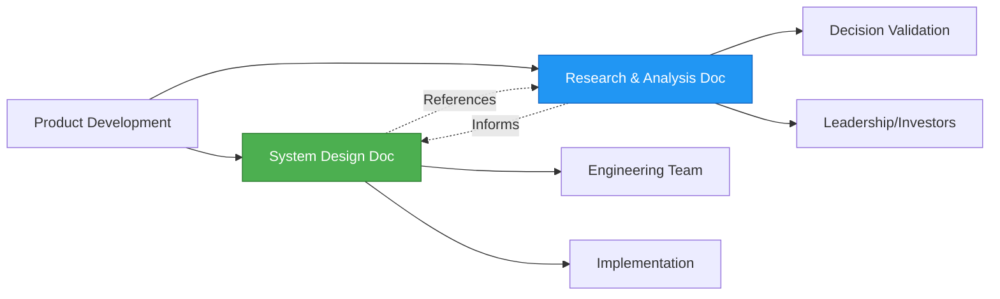

# Documentation Governance Pattern

**Family Privacy Hub - Documentation Strategy**

> [!IMPORTANT]
> This document defines how we maintain and evolve our documentation as the project progresses toward "true north" (product-market fit and launch).

---

## Document Structure Philosophy

### Two-Document Approach

We maintain **two complementary documents** with distinct purposes:



### **Document 1: System Design**

**File:** `SYSTEM_DESIGN.md`  
**Purpose:** Executable blueprint - what we're building and how  
**Owner:** Product Manager + Tech Lead  
**Update Frequency:** Weekly during active development  
**Audience:** Engineering, DevOps, Security, Product

**Contains:**

- Product vision and value proposition
- Service architecture
- Hardware specifications
- System architecture diagrams
- Deployment procedures
- Cost structure and ROI

**Style:** Prescriptive, action-oriented, present/future tense

---

### **Document 2: Research & Analysis**

**File:** `RESEARCH_ANALYSIS.md`  
**Purpose:** Decision rationale and supporting evidence  
**Owner:** Product Manager  
**Update Frequency:** Quarterly or when major decisions are made  
**Audience:** Leadership, Investors, Future Team Members

**Contains:**

- Market validation data
- Competitive analysis
- Service evaluations
- Architecture trade-offs
- Historical decisions and pivots
- Supporting research and citations

**Style:** Analytical, evidence-based, past tense (historical record)

---

## Consolidation Methodology

### Phase 1: Initial Consolidation (Complete)

We followed this pattern to create the initial documents:

```
Source Materials:
├─ home_appliance_service_evaluation.md
├─ hardware_comparison_analysis.md
├─ market_validation_supplement.md
└─ original_plan_audit.md

↓ Consolidation Process ↓

Document 1 (System Design):
├─ Extract: Final recommendations
├─ Extract: Architecture decisions
├─ Extract: Hardware specifications
├─ Synthesize: Actionable implementation plan
└─ Format: Clear, prescriptive

Document 2 (Research):
├─ Preserve: All market research
├─ Preserve: Comparison analyses
├─ Preserve: Decision rationale
├─ Organize: By topic area
└─ Format: Evidence-based
```

**Key Principle:** Nothing is lost - content is reorganized by purpose, not deleted.

---

## Update Workflow

### When to Update Documents

**System Design Document Updates Triggered By:**

- ✅ Architecture changes
- ✅ Hardware specification changes
- ✅ Service additions/removals
- ✅ Deployment procedure updates
- ✅ Cost model changes
- ✅ Weekly sprint reviews (minor updates)

**Research & Analysis Document Updates Triggered By:**

- ✅ New competitive intelligence
- ✅ Market data updates
- ✅ Major architectural pivots (document the "why")
- ✅ Customer feedback that changes assumptions
- ✅ Quarterly reviews (broader updates)

---

### Update Process

#### For System Design Updates

```
1. Identify Change
   ├─ What changed? (e.g., "Added MQTT broker service")
   ├─ Why changed? (e.g., "IoT device integration requirement")
   └─ Impact? (e.g., "Adds 256MB RAM requirement")

2. Governance Check-In (if applicable)
   ├─ Check with AI Ops/Sec Agent (Governance Service)
   ├─ Validate against security policies
   ├─ Confirm compliance requirements
   └─ Get approval before proceeding

   NOTE: Required for security/network/deployment changes
   Optional for documentation/cost updates

3. Update System Design Doc
   ├─ Update relevant sections
   ├─ Update architecture diagrams
   ├─ Update cost/resource calculations
   └─ Bump version number

4. Cross-Reference Research Doc
   ├─ Does this decision need research backing?
   ├─ If yes → Add supporting analysis to Research Doc
   └─ Link between documents

4. Communicate Change
   ├─ Update changelog in doc
   ├─ Notify engineering team
   └─ Update implementation tasks
```

#### For Research & Analysis Updates

```
1. New Information Arrives
   ├─ Market data
   ├─ Competitive moves
   ├─ Customer insights
   └─ Technology shifts

2. Document in Research Doc
   ├─ Add to relevant section
   ├─ Cite sources
   ├─ Date-stamp finding
   └─ Tag with version

3. Evaluate Impact on System Design
   ├─ Does this change our direction?
   ├─ If yes → Trigger System Design update
   └─ If no → Keep as reference

4. Archive if Outdated
   ├─ Move superseded info to appendix
   ├─ Mark as "Historical - YYYY-MM-DD"
   └─ Keep for decision archaeology
```

---

## Version Control Strategy

### Document Versioning

**System Design Document:**

- **Major version** (X.0): Significant architecture changes
- **Minor version** (x.Y): Service additions, hardware changes
- **Patch** (x.y.Z): Clarifications, corrections, cost updates

**Research & Analysis Document:**

- **Date-based versioning**: `YYYY-MM-DD` snapshots
- Append new research, archive old findings
- Quarterly comprehensive reviews

### Example Version History

```markdown
## System Design Changelog

### v2.0 (2024-12-16) - Architecture Pivot

- BREAKING: Changed from ARM to x86 Intel
- ADDED: Jellyfin as core service
- ADDED: Frigate NVR as core service
- CHANGED: Home Assistant promoted to #1 service
- REMOVED: PhotoPrism from core (moved to optional)

### v1.1 (2024-11-18) - Original Plan

- Initial: Dual Orange Pi 5 Plus architecture
- Services: PhotoPrism, Email, Nextcloud
```

---

## True North Alignment

### Definition of "True North"

**Our True North:** Privacy-first home automation appliance that replaces expensive cloud subscriptions with local control, achieving product-market fit in the $64B smart home market.

**Key Metrics:**

- Customer acquisition cost < $100
- Payback period < 12 months for customer
- 30%+ gross margin
- 90%+ customer satisfaction (privacy/control)

### How Documents Guide to True North

**System Design Document:**

- ✅ Ensures engineering builds toward market-validated services
- ✅ Optimizes for cost and performance targets
- ✅ Keeps team focused on MVP scope

**Research & Analysis Document:**

- ✅ Validates we're solving real market problems
- ✅ Tracks competitive landscape evolution
- ✅ Preserves decision context for future pivots

---

## Periodic Review Cadence

### Weekly (During Active Development)

**Owner:** Tech Lead + Product Manager  
**Focus:** System Design updates

```
□ Review implementation progress
□ Update architecture if needed
□ Adjust cost/resource estimates
□ Document blockers or risks
```

### Monthly

**Owner:** Product Manager  
**Focus:** Alignment check

```
□ Validate service priorities
□ Review customer feedback
□ Check competitive landscape
□ Minor Research Doc updates
```

### Quarterly

**Owner:** Product Manager + Leadership  
**Focus:** Strategic review

```
□ Comprehensive Research Doc update
□ Market data refresh
□ True North alignment check
□ Major pivots if needed
```

### Before Major Milestones

**Trigger:** MVP launch, hardware changes, funding rounds  
**Focus:** Both documents

```
□ Full document audit
□ Stakeholder review
□ Version bump
□ Archive previous state
```

---

## Cross-Document Linking Strategy

### How Documents Reference Each Other

**System Design → Research:**

```markdown
## Hardware Architecture

We chose Intel x86 architecture for the following reasons:

- Superior Jellyfin performance (Intel Quick Sync)
- Frigate NVR optimization (OpenVINO)
- Better software compatibility

> **Rationale:** See [Hardware Comparison Analysis](RESEARCH_ANALYSIS.md#hardware-comparison)
> for detailed ARM vs x86 evaluation.
```

**Research → System Design:**

```markdown
## ARM vs x86 Analysis

Based on this analysis, we recommend Intel x86 for production use.

> **Implementation:** See [System Design - Hardware Specs](SYSTEM_DESIGN.md#hardware-tiers)
> for final specifications.
```

**Pattern:** Always bidirectional links for traceability.

---

## Decision Documentation Template

When making a significant decision, use this template:

### In Research Doc (Decision Record)

```markdown
## Decision: [Title]

**Date:** YYYY-MM-DD  
**Status:** [Proposed | Accepted | Superseded]  
**Owner:** [Name]

### Context

What is the issue or decision we're facing?

### Options Considered

1. Option A - [description]
2. Option B - [description]
3. Option C - [description]

### Decision

We chose [Option X] because...

### Consequences

- Positive: [benefits]
- Negative: [trade-offs]
- Risks: [what could go wrong]

### Implementation

See [System Design](SYSTEM_DESIGN.md#section) for how this is implemented.
```

### In System Design (Implementation)

```markdown
## [Feature/Component]

**Implementation of:** [Decision: Title](RESEARCH_ANALYSIS.md#decision-title)

[Technical specifications and implementation details]
```

---

## Conflict Resolution

### When Documents Diverge

If System Design and Research documents contradict:

1. **System Design is source of truth** for current state
2. **Research Doc explains why** we got here
3. **Reconcile immediately:**
   - Update outdated document
   - Add note explaining divergence
   - Bump version

**Example:**

```markdown
> [!WARNING]
> This section was updated on 2024-12-16 to reflect architecture pivot.
> Previous ARM-based approach documented in Research Doc (v2024-11-18).
```

---

## Archival Strategy

### When to Archive Content

**Archive when:**

- ✅ Decision is superseded (e.g., ARM → x86 pivot)
- ✅ Service is removed from stack
- ✅ Market data is >6 months old
- ✅ Competitive analysis is outdated

**How to Archive:**

```markdown
## Appendix: Historical Decisions

### [2024-11-18] ARM Architecture (Superseded)

Original plan used ARM-based Orange Pi hardware.

**Why we changed:** See [Decision: Pivot to x86](#decision-pivot-x86)

**Historical docs:** See `archive/ARM_PLAN_2024-11.md`
```

**Never delete** - always move to appendix or archive directory.

---

## Document Maintenance Checklist

### Weekly Maintenance (5 min)

```
□ Update System Design with implementation changes
□ Check for broken links between documents
□ Update version/date stamps
```

### Monthly Maintenance (30 min)

```
□ Review and update cost estimates
□ Check competitive landscape for changes
□ Update service priorities if needed
□ Sync documents for consistency
```

### Quarterly Maintenance (2 hours)

```
□ Full document audit
□ Archive outdated content
□ Refresh market data
□ Stakeholder review session
□ Version bump and changelog update
```

---

## Tools and Automation

### Recommended Tools

**Version Control:**

- Git for document versioning
- Tag major versions: `v2.0-system-design`
- Branch for major rewrites

**Link Checking:**

```bash
# Check for broken internal links
markdown-link-check *.md
```

**Changelog Generation:**

```bash
# Auto-generate changelog from commits
git log --oneline --decorate
```

**Diff Tracking:**

```bash
# Compare versions
git diff v1.0..v2.0 SYSTEM_DESIGN.md
```

---

## Success Metrics

**How we know this governance is working:**

✅ **Engineers can find what they need in <2 minutes**  
✅ **New team members understand decisions within 1 day**  
✅ **Leadership can validate direction in quarterly reviews**  
✅ **No duplicate/conflicting information across docs**  
✅ **Decision history is traceable (no "why did we do this?" questions)**

---

## This Document's Lifecycle

**This governance doc itself:**

- Review: Annually or when process breaks
- Update: When team grows or workflow changes
- Owner: Product Manager

**Current Version:** v1.0 (2024-12-16)

---

## Quick Reference

### When Should I Update Which Doc?

| Change Type          | System Design | Research Doc           |
| -------------------- | ------------- | ---------------------- |
| Add a service        | ✅ Yes        | ✅ Yes (rationale)     |
| Change hardware spec | ✅ Yes        | Maybe (if major pivot) |
| New market data      | No            | ✅ Yes                 |
| Deployment procedure | ✅ Yes        | No                     |
| Cost update          | ✅ Yes        | Maybe (if significant) |
| Competitive move     | No            | ✅ Yes                 |
| Architecture diagram | ✅ Yes        | Maybe (reference)      |
| Decision rationale   | Link only     | ✅ Yes (full detail)   |

### Emergency Pivot Protocol

If major direction change is needed:

1. **Pause development** (1 hour)
2. **Emergency meeting** - Product + Tech Lead
3. **Update Research Doc** with new analysis (same day)
4. **Draft System Design changes** (within 24 hours)
5. **Team review** (within 48 hours)
6. **Version bump** both documents (major version)
7. **Communicate broadly** to all stakeholders
8. **Archive old approach** with clear tags

---

## Contact

**Questions about this governance pattern?**  
**Owner:** Product Manager  
**Last Review:** 2024-12-16  
**Next Review:** 2025-03-16 (Quarterly)
