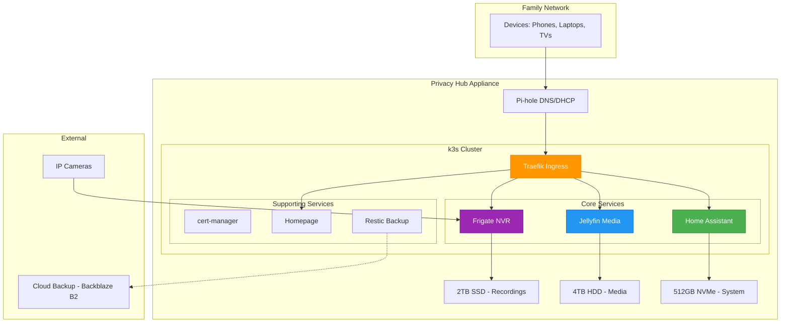

# Family Privacy Hub - System Design Document

**Version 2.0** | **Date:** 2024-12-16 | **Status:** Active Development

> [!IMPORTANT]
> This is the authoritative specification for the Family Privacy Hub. All implementation work should reference this document.

---

## Document Control

**Owner:** Product Manager + Tech Lead  
**Last Updated:** 2024-12-16  
**Next Review:** 2024-12-23 (Weekly during active development)  
**Supporting Research:** [Research & Analysis Document](RESEARCH_ANALYSIS.md)

**Changelog:**

- **v2.0** (2024-12-16): Architecture pivot from ARM to x86, service stack realignment
- **v1.0** (2024-11-18): Original ARM-based design (see archive)

---

## 1. Product Vision

### Value Proposition

**Family Privacy Hub** is a privacy-first home automation appliance that replaces expensive cloud subscriptions ($1,200+/year) with local control - giving families ownership of their smart home, media, and security without recurring costs.

**Tagline:** _"Your Smart Home, Your Data, Your Control - Forever."_

### Market Positioning

| Competitor             | Their Approach                | Our Advantage                                     |
| ---------------------- | ----------------------------- | ------------------------------------------------- |
| **Google Nest**        | Premium cloud + subscriptions | Local control, no subscriptions, privacy-first    |
| **Amazon Ring**        | Budget cloud + subscriptions  | Total cost of ownership savings (18-month ROI)    |
| **Synology NAS**       | Technical, file-focused       | Consumer appliance, turnkey smart home            |
| **DIY (Raspberry Pi)** | Complex setup, maintenance    | Appliance-grade reliability, professional support |

**Differentiation:** We combine Nest's premium user experience with open-source freedom and zero recurring costs.

> **Market Context:** See [Research Doc - Market Validation](RESEARCH_ANALYSIS.md#market-validation)

---

## 2. Target Customers

### Primary: Privacy-Conscious Families

- Age: 30-50, Household income: $80K-150K+
- Values: Data ownership, privacy, control
- Pain: Frustrated by cloud services and subscription fatigue
- Willingness: Pay premium upfront for ownership

### Secondary: Tech Enthusiasts

- Age: 25-45, Existing home automation users
- Current: DIY Home Assistant setups, self-hosters
- Need: Appliance-grade reliability without complexity
- Benefit: Pre-configured, production-ready platform

### Tertiary: Cost-Conscious Smart Home Users

- Age: 25-55, Growing smart home ecosystems
- Pain: $50-100+/month in smart home subscriptions
- ROI: Break-even in 12-18 months vs. cloud services

---

## 3. Service Stack

### Core Services (Required in All Tiers)

#### 3.1 Home Assistant - Smart Home Platform

**Priority:** #1 Foundation

**Purpose:** Vendor-neutral smart home automation hub

**Key Features:**

- 1000+ device integrations (Alexa, Google, HomeKit, Matter, Zigbee, etc.)
- Powerful automation engine
- Local control and privacy
- Voice assistant support
- Energy management
- Mobile apps (iOS/Android)

**Resource Requirements:**

- RAM: 2-4GB
- Storage: 10-20GB
- Network: Internal only (via ingress)

**Integration:**

- k3s deployment via Helm chart
- Ingress: `home.lan` or `homeassistant.home.lan`
- Persistent storage for configuration
- Dashboard integration via Homepage/Dashy

---

#### 3.2 Jellyfin - Media Server

**Priority:** #2 High Value

**Purpose:** Privacy-focused media streaming platform (Netflix-like UX for personal content)

**Key Features:**

- Stream movies, TV, music, photos to any device
- Intel Quick Sync hardware transcoding (4K support)
- Multi-user with parental controls
- No cloud, no telemetry, no premium tiers
- Mobile apps and TV apps
- Live TV and DVR support

**Resource Requirements:**

- RAM: 4-8GB (transcoding)
- Storage: 4TB+ HDD for media library
- CPU: Intel Quick Sync required (Intel N100+)
- Network: High bandwidth for streaming

**Integration:**

- k3s deployment via Docker container
- Ingress: `media.home.lan` or `jellyfin.home.lan`
- Dedicated media storage volume
- Hardware acceleration via Intel iGPU passthrough

**Why Intel Required:** See [Research Doc - Jellyfin Analysis](RESEARCH_ANALYSIS.md#jellyfin-evaluation)

---

#### 3.3 Frigate NVR - Home Security

**Priority:** #3 Security

**Purpose:** AI-powered local network video recorder

**Key Features:**

- Real-time AI object detection (people, vehicles, animals)
- 24/7 recording with smart alerts
- Low-latency WebRTC live viewing
- Home Assistant integration
- Face recognition and license plate reading
- No cloud, complete privacy

**Resource Requirements:**

- RAM: 4-8GB (depends on camera count)
- Storage: 150GB per camera per week (24/7 recording)
- AI Accelerator: Intel iGPU (OpenVINO) or Google Coral TPU
- Cameras: ONVIF/RTSP compatible IP cameras

**Integration:**

- k3s deployment via Docker container
- Ingress: `security.home.lan` or `frigate.home.lan`
- Intel iGPU passthrough for AI detection
- Home Assistant integration for automations
- Dedicated high-speed storage (SSD recommended)

**Camera Sizing:**

- 1-3 cameras: 500GB-1TB SSD
- 4-6 cameras: 1-2TB SSD
- 7+ cameras: 2-4TB SSD

---

### Supporting Services (Included)

#### 3.4 DNS & Ad-Blocking - Pi-hole or AdGuard Home

- Network-wide ad blocking
- Custom local domain resolution (\*.home.lan)
- Privacy protection
- Safe browsing for family
- Integration with k3s CoreDNS

#### 3.5 TLS Certificate Management - cert-manager

- Automated certificate lifecycle
- Self-signed CA for internal use
- Wildcard certificates for \*.home.lan
- Automatic renewal

#### 3.6 Backup Service - Restic or Duplicati

- Automated backup to external storage or cloud (Backblaze B2)
- 3-2-1 backup rule compliance
- Encrypted backups
- Regular testing

#### 3.7 Dashboard - Homepage or Dashy

- Unified landing page (`home.lan`)
- Service status indicators
- Quick links to all services
- No need to remember ports/URLs

---

### Optional Services (Premium Tier)

#### 3.8 PhotoPrism - AI Photo Management

- AI-powered organization and tagging
- Face recognition
- Requires: 2-4GB RAM, GPU acceleration (Premium tier)
- **Note:** Downgraded from core to optional based on market analysis

#### 3.9 Nextcloud - File Sync & Collaboration

- Cross-device file synchronization
- Document collaboration
- Calendar and contacts (CalDAV/CardDAV)

#### 3.10 Email Server - Mailcow or Mailu

- Self-hosted email (advanced users only)
- High maintenance, requires domain and TLS

---

## 4. Hardware Architecture

### Hardware Philosophy

**Intel x86 Architecture Required** for Jellyfin (Quick Sync) and Frigate (OpenVINO).

> **Rationale:** See [Research Doc - Hardware Comparison](RESEARCH_ANALYSIS.md#hardware-comparison)

---

### Tier 1: Basic Home Hub

**Price:** $350-400  
**Target:** Small families, smart home only

**Hardware:**

- **Platform:** Intel N100 Mini PC
- **CPU:** Intel N100 (4-core, 3.4GHz, 6W TDP)
- **RAM:** 16GB DDR4/DDR5
- **Storage:** 512GB NVMe SSD + 4TB HDD
- **Network:** Dual 2.5GbE
- **Power:** 10-15W typical

**Services:**

- Home Assistant
- Jellyfin (limited to 1-2 concurrent transcode streams)
- DNS/DHCP (Pi-hole)
- Dashboard

**Performance:**

- Users: 2-4 concurrent
- Jellyfin: 1-2x 1080p streams OR 1x 4K stream
- Uptime: 95%+

**Cost Breakdown:**

```
Intel N100 Mini PC (16GB/512GB)  : $200-250
4TB HDD (media storage)          : $80-100
Accessories (cables, etc)        : $20-30
─────────────────────────────────
TOTAL                            : $350-400

*Prices as of December 2024, subject to market changes
```

---

### Tier 2: Standard Complete Hub ⭐ RECOMMENDED

**Price:** $850-900  
**Target:** Medium families, full service stack

**Hardware:**

- **Platform:** Intel i5-12400 or i5-13400 Mini PC
- **CPU:** Intel i5 (6P+4E cores, up to 4.4GHz)
- **RAM:** 32GB DDR4
- **Storage:** 512GB NVMe SSD (system) + 2TB SSD (Frigate) + 4TB HDD (media)
- **Network:** Dual 2.5GbE
- **Power:** 25-30W typical

**Services:**

- Home Assistant
- Jellyfin (3-5 concurrent 4K transcodes)
- Frigate NVR (4-6 cameras)
- All supporting services

**Performance:**

- Users: 4-8 concurrent
- Jellyfin: 3-5x 4K streams
- Frigate: 4-6 cameras with AI detection
- Uptime: 99%+

**Cost Breakdown:**

```
Intel i5 Mini PC (32GB/512GB)    : $450-500
2TB NVMe SSD (Frigate storage)   : $150-180
4TB HDD (media storage)          : $80-100
PoE switch (for cameras)         : $70-90
Accessories                      : $30-50
─────────────────────────────────
TOTAL (without cameras)          : $850-900

Optional: 4x IP Cameras          : +$200-400
TOTAL (with cameras)             : $1,050-1,300

*Prices as of December 2024, subject to market changes
```

---

### Tier 3: Premium High Availability

**Price:** $1,400-1,900  
**Target:** Large families, power users, HA required

**Option A: Dual Intel i5 (High Availability)**

- **Platform:** 2× Intel i5-12400 Mini PC
- **CPU:** Dual 6P+4E core systems
- **RAM:** 32GB DDR4 each (64GB total)
- **Storage:** Each node has 512GB NVMe + shared NAS
- **HA:** k3s dual-node cluster with automatic failover
- **Network:** 2.5GbE/10GbE switch

**Option B: Hybrid Intel + Jetson (AI Optimized)**

- **Primary:** Intel i5 for Jellyfin + Frigate
- **Secondary:** NVIDIA Jetson Orin Nano for PhotoPrism AI
- **Benefit:** Best of both worlds (x86 media + ARM AI)

**Services:**

- All core + optional services
- PhotoPrism with GPU acceleration
- Advanced automations
- High availability (Option A)

**Performance:**

- Users: 8-15+ concurrent
- Jellyfin: 5+ concurrent 4K transcodes
- Frigate: 7+ cameras
- Uptime: 99.9%+ (with HA)

**Cost Breakdown (Option A - HA):**

```
2× Intel i5 Mini PC (32GB)       : $900-1,000
4-bay NAS (shared storage)       : $200-300
16TB NAS capacity (4×4TB)        : $400-500
2.5GbE switch                    : $80-150
UPS (1500VA)                     : $150-200
Rack/mounting                    : $50-100
─────────────────────────────────
TOTAL                            : $1,780-2,250

*Prices as of December 2024, subject to market changes
```

---

## 5. System Architecture

### High-Level Architecture



---

### Network Architecture

**DNS Strategy:**

- **External DNS:** Pi-hole for ad-blocking and privacy
- **Internal DNS:** CoreDNS (k3s) for service discovery
- **Domain:** `*.home.lan` (internal only)

**Service Access:**

```
https://home.lan              → Dashboard (Homepage)
https://homeassistant.home.lan → Home Assistant
https://media.home.lan        → Jellyfin
https://security.home.lan     → Frigate NVR
```

**Network Segmentation:**

- Management VLAN (appliance admin)
- IoT VLAN (smart home devices)
- Camera VLAN (security cameras, isolated)
- Family VLAN (user devices)

---

### Storage Architecture

**System Storage (512GB NVMe SSD):**

- OS and k3s: 50GB
- Container images: 20-30GB
- Home Assistant config: 10-20GB
- Logs and metrics: 10-20GB
- Headroom: 400GB+

**Frigate Storage (2TB SSD):**

- 24/7 recording: 150GB per camera per week
- 4 cameras: ~600GB/week
- Retention: 2-3 weeks with 2TB

**Media Storage (4TB HDD):**

- Movies (1080p): ~1,000 movies at 4GB each
- TV Shows: 50-100 full seasons
- Music library: 50,000+ songs
- Photos: 100,000+ high-res photos

**Backup Strategy:**

- Local: USB external drive (weekly full backup)
- Cloud: Backblaze B2 (encrypted incremental)
- Testing: Monthly restore validation

---

### Compute Resource Allocation

**Tier 2 (Standard) Resource Plan:**

```
Total RAM: 32GB
├─ k3s overhead: 2GB
├─ Home Assistant: 4GB
├─ Jellyfin: 8GB (transcoding)
├─ Frigate: 8GB (AI + recording)
├─ Pi-hole: 256MB
├─ Dashboard: 256MB
├─ Monitoring: 2GB (Prometheus/Grafana)
└─ Available: 7.5GB (buffer)

Total Storage:
├─ System: 512GB NVMe (fast I/O)
├─ Frigate: 2TB SSD (high IOPS)
└─ Media: 4TB HDD (cost-effective)

Total Network:
└─ 2.5GbE sufficient for 4-6 cameras + media streaming
```

---

## 6. Deployment Architecture

### Deployment Strategy

**Base OS:** Ubuntu Server 22.04 LTS or Debian 12  
**Orchestration:** k3s (lightweight Kubernetes)  
**GitOps:** Optional (ArgoCD/Flux for advanced users)

### k3s Cluster Configuration

**Single Node (Tier 1, Tier 2):**

```yaml
k3s server:
  - Control plane + workload
  - Embedded etcd (single-node)
  - Local storage (local-path provisioner)
  - MetalLB for LoadBalancer IPs
```

**Dual Node HA (Tier 3):**

```yaml
k3s cluster:
  - 2× server nodes (HA control plane)
  - Embedded etcd with HA
  - Distributed storage (Longhorn or NFS)
  - MetalLB for VIP failover
  - Automatic pod failover
```

---

### Service Deployment

All services deployed via Helm charts or Docker Compose (converted to k3s manifests).

**Home Assistant:**

```bash
helm repo add home-assistant https://pajikos.github.io/home-assistant-helm-chart/
helm install home-assistant home-assistant/home-assistant \
  --set persistence.enabled=true \
  --set ingress.enabled=true \
  --set ingress.hosts[0].host=homeassistant.home.lan
```

**Jellyfin:**

```yaml
# Hardware acceleration enabled
apiVersion: v1
kind: Pod
spec:
  containers:
    - name: jellyfin
      image: jellyfin/jellyfin:latest
      resources:
        limits:
          gpu.intel.com/i915: 1 # Intel Quick Sync
```

**Frigate:**

```yaml
# OpenVINO detector
apiVersion: v1
kind: Pod
spec:
  containers:
    - name: frigate
      image: ghcr.io/blakeblackshear/frigate:stable
      env:
        - name: FRIGATE_DETECTOR
          value: "openvino"
```

---

## 7. Security Architecture

### Security Layers

**Layer 1: Network Security**

- Firewall: UFW or iptables
- VLANs: IoT/Camera isolation
- No external exposure (internal only)
- VPN: Tailscale or WireGuard for remote access

**Layer 2: TLS/Encryption**

- Internal CA (self-signed certificates)
- TLS for all web interfaces
- Encrypted backup (Restic encryption)

**Layer 3: Access Control**

- Home Assistant: User authentication
- Jellyfin: Multi-user with permissions
- Frigate: Authentication required
- Dashboard: Optional auth (internal network)

**Layer 4: System Hardening**

- Minimal attack surface (no unnecessary services)
- Regular security updates (unattended-upgrades)
- Audit logging (systemd journal)
- Monitoring alerts (Prometheus Alertmanager)

**Layer 5: Governance & Compliance**

- **AIOps/Sec Governance Service** integration
- Policy validation before deployments
- Security posture monitoring
- Compliance reporting
- Automated remediation suggestions

> [!IMPORTANT] > **Governance Check-In Requirement:**  
> All configuration changes and deployments must check in with the Governance service (AI ops/sec agent) for policy validation before execution. This ensures compliance with security policies and operational best practices.

---

## 8. Monitoring & Observability

### Metrics Collection

**Prometheus Stack:**

- node_exporter: System metrics (CPU, RAM, disk)
- cadvisor: Container metrics
- kube-state-metrics: k3s cluster health
- Service-specific exporters:
  - Home Assistant metrics
  - Jellyfin playback stats
  - Frigate detection counts

**Governance Service Integration:**

> [!NOTE]
> This appliance integrates with the AIOps/Sec Governance Service for policy validation and compliance checking.
>
> - Policy check-ins during deployment
> - Security posture validation
> - Compliance monitoring
> - See: [AIOps Substrate Integration](#aiops-substrate-integration)

**Grafana Dashboards:**

- System overview
- Service health
- k3s cluster status
- Storage usage trend
- Network throughput

### Alerting

**Alert Conditions:**

- Service down >5 minutes
- Disk usage >85%
- RAM usage >90%
- CPU temp >80°C
- Backup failure
- Certificate expiry <30 days

**Notification Channels:**

- Home Assistant mobile app
- Email (if configured)
- Dashboard status indicators

---

## 9. Cost Analysis & ROI

### Hardware Cost Summary

| Tier             | Hardware     | Services   | Total  | $/User\* |
| ---------------- | ------------ | ---------- | ------ | -------- |
| **Basic**        | $350-400     | HA + Media | $400   | $100-133 |
| **Standard**     | $850-900     | Full Stack | $900   | $113-150 |
| **Premium (HA)** | $1,400-1,900 | Full + HA  | $1,650 | $110-183 |

\*Based on midpoint target users

---

### Subscription Savings Analysis

**Cloud Equivalent Costs (Annual):**

```
Google Nest Aware (4 cameras):   $720/year
Ring Protect Plus:                $200/year
Plex Pass (lifetime alternative): $120/year
─────────────────────────────────────────
Total Annual Subscriptions:       $1,040-1,200/year
```

**ROI Calculation (Tier 2 - Standard):**

```
Upfront Cost:           $900
Annual Subscription Savings: $1,200/year
───────────────────────────────────────
Payback Period:         9 months
3-Year Total Savings:   $2,700
5-Year Total Savings:   $5,100
```

**Key Message:** _Family Privacy Hub pays for itself in less than 12 months, then saves $1,200+/year forever._

---

### Total Cost of Ownership (3 Years)

| Solution                                | Upfront | Year 1-3 Subscriptions | Total (3yr) |
| --------------------------------------- | ------- | ---------------------- | ----------- |
| **Cloud Services** (Nest + Ring + Plex) | $600    | $3,600                 | **$4,200**  |
| **Privacy Hub (Tier 2)**                | $900    | $0                     | **$900**    |
| **Savings**                             | -$300   | +$3,600                | **+$3,300** |

---

## 10. Deployment Phases

### Phase 1: MVP Foundation (Weeks 1-2)

**Goal:** Core smart home functionality

**Deliverables:**

- ✅ Deploy Ubuntu Server + k3s
- ✅ Install Home Assistant
- ✅ Configure DNS/DHCP (Pi-hole)
- ✅ Set up Dashboard (Homepage)
- ✅ Configure basic backup

**Success Criteria:**

- Home Assistant accessible at `homeassistant.home.lan`
- Dashboard shows service status
- Backup runs nightly

---

### Phase 2: Media Server (Weeks 3-4)

**Goal:** Add high-value media streaming

**Deliverables:**

- ✅ Install Jellyfin with Intel Quick Sync
- ✅ Add 4TB HDD for media storage
- ✅ Import initial media library (movies/TV)
- ✅ Test 4K transcoding performance

**Success Criteria:**

- 3+ concurrent 4K transcodes working
- Mobile app playback smooth
- Family can access media library

---

### Phase 3: Security System (Weeks 5-6)

**Goal:** Deploy local security cameras

**Deliverables:**

- ✅ Install Frigate NVR
- ✅ Add 2TB SSD for recordings
- ✅ Configure 2-4 cameras
- ✅ Set up Home Assistant automations
- ✅ Test AI object detection

**Success Criteria:**

- Cameras recording 24/7
- AI detection <100ms latency
- Mobile notifications working
- Integrations with Home Assistant

---

### Phase 4: Production Hardening (Weeks 7-8)

**Goal:** Security and reliability

**Deliverables:**

- ✅ Implement network segmentation (VLANs)
- ✅ Configure UPS for power protection
- ✅ Set up remote access (Tailscale VPN)
- ✅ Deploy monitoring (Prometheus/Grafana)
- ✅ Comprehensive backup testing
- ✅ User training and documentation

**Success Criteria:**

- 99%+ uptime measured
- Backups tested and verified
- Remote access working securely
- Family trained on all features

---

## 11. Success Metrics

### System Health KPIs

- **Uptime:** 99%+ (Tier 1), 99.9%+ (Tier 3 HA)
- **Response Time:** <500ms for all web interfaces
- **Backup Success Rate:** 100% (weekly validation)
- **Security Incidents:** 0 (intrusion detection)

### User Experience KPIs

- **Jellyfin Playback:** <2 second start time
- **Frigate Detection:** <100ms latency
- **Home Assistant Response:** <200ms for automations
- **Dashboard Load Time:** <1 second

### Business KPIs

- **Customer ROI:** <12 month payback period
- **Support Tickets:** <1 per customer per month
- **Uptime SLA:** 99%+ guarantee
- **Customer Satisfaction:** 90%+ (privacy/control)

---

## 12. Risks & Mitigation

| Risk                           | Impact   | Probability | Mitigation                                           |
| ------------------------------ | -------- | ----------- | ---------------------------------------------------- |
| Hardware failure               | High     | Medium      | UPS, dual-node HA (Tier 3), warranty                 |
| Data loss                      | Critical | Low         | 3-2-1 backup strategy, automated testing             |
| Intel Quick Sync compatibility | High     | Low         | Test before purchase, fallback to software transcode |
| Network outage                 | Medium   | Medium      | UPS for network gear, local operation continues      |
| Software bugs                  | Medium   | Medium      | Staging environment, rollback procedures             |

---

## 13. Future Roadmap

### Q1 2025: MVP Launch

- Basic, Standard, Premium tiers available
- Core services (HA, Jellyfin, Frigate)
- Initial customer deployments

### Q2 2025: Enhancement

- Add PhotoPrism (optional service)
- Nextcloud integration
- Advanced automation templates
- Mobile app improvements

### Q3 2025: Scale

- HA clustering for all tiers
- Camera bundles (appliance + cameras)
- Professional installation option
- Community forum launch

### Q4 2025: Expansion

- Additional service integrations
- Zigbee/Z-Wave coordinator built-in
- Voice assistant (local Whisper/Piper)
- International markets

---

## 14. References

**Supporting Documentation:**

- [Research & Analysis Document](RESEARCH_ANALYSIS.md) - Market validation and decision rationale
- [Documentation Governance](DOCUMENTATION_GOVERNANCE.md) - How to maintain these documents
- [Original Plan Archive](archive/ARM_PLAN_2024-11.md) - Historical ARM-based design

**External Resources:**

- Home Assistant: https://www.home-assistant.io
- Jellyfin: https://jellyfin.org
- Frigate NVR: https://frigate.video
- k3s Documentation: https://k3s.io

---

## 15. Appendix

### A. Glossary

- **HA:** High Availability
- **k3s:** Lightweight Kubernetes distribution
- **NVR:** Network Video Recorder
- **Quick Sync:** Intel hardware video transcoding
- **OpenVINO:** Intel AI inference toolkit
- **ONVIF:** Open Network Video Interface Forum (camera standard)

### B. Hardware Compatibility List

**Tested Mini PCs (Intel N100):**

- ACEMAGIC T8 Plus
- Beelink EQ12
- GMKtec NucBox K1

**Tested Mini PCs (Intel i5):**

- ASUS PN51
- Minisforum UM690
- Intel NUC 12/13

**Tested Cameras:**

- Reolink RLC-410W
- Amcrest IP4M
- Hikvision DS-2CD2x85

### C. Container Image Registry

All container images pulled from:

- Docker Hub (public)
- GitHub Container Registry
- Self-hosted option available (Harbor)

---

**End of System Design Document**

**Next Review:** 2024-12-23 (Weekly)  
**Version:** 2.0
