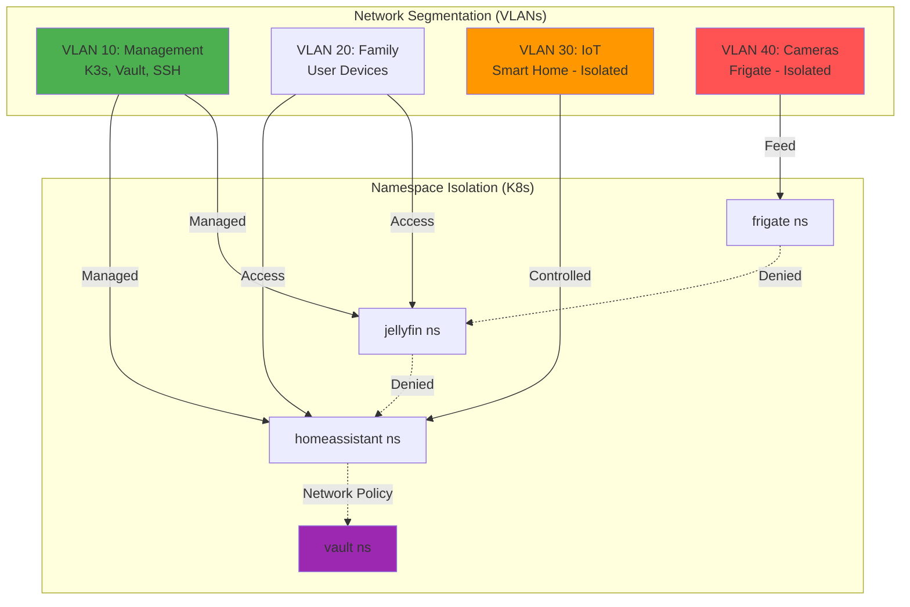

# OPS-PICERL-CONTAINMENT: Environment Isolation & Change Control

**Document Type:** Operations - PICERL Phase: Containment  
**Version:** 2.0 | **Last Updated:** 2025-12-16  
**Audience:** Operators, Change Managers, Release Engineers

> 👤 **Quick Navigation:**  
> Emergency → [Jump to Emergency Isolation](#runbook-c3-emergency-isolation)  
> Change Control → [Jump to Change Windows](#procedures-change-management)  
> Network → [Jump to VLANs](#standards-network-segmentation)

---

## 📊 At-a-Glance (30 seconds)

**Purpose:** Prevent issues from spreading through environment isolation, network segmentation, and change control.

**TL;DR - Containment Strategy:**

1. **Network Isolation:** VLANs separate IoT/Camera/Management traffic
2. **Namespace Isolation:** K8s network policies prevent cross-namespace traffic
3. **Change Windows:** Production changes only during approved windows



**Critical Principle:** Defense in depth - multiple isolation layers prevent lateral movement.

---

## 🚀 Quick Start (5 minutes)

### Change Type Decision Tree

```
What are you changing?
├─ Production service config
│  ├─ During change window?
│  │  ├─ Yes → Runbook C1 (Approved Change)
│  │  └─ No → Request emergency approval
│  └─ Has rollback plan?
│     ├─ Yes → Proceed
│     └─ No → Create rollback plan first
│
├─ Network/Firewall rules
│  └─ Runbook C2 (Network Changes)
│
├─ Emergency isolation needed
│  └─ Runbook C3 (Emergency)
│
└─ Development/testing
   └─ No approval needed (use dev namespace)
```

### Change Control Checklist

**Before ANY production change:**

- [ ] Change has approval (or within approved window)
- [ ] Rollback plan documented
- [ ] Backup created (< 6 hours old)
- [ ] Monitoring alerts configured
- [ ] Communication sent (if user-facing)

---

## 📋 Policy (Intent - WHY)

### 1. Environment Isolation Policy

**Intent:** Prevent development/test issues from affecting production; prevent compromised services from spreading.

**Principles:**

- Production runs in dedicated namespaces with network policies
- IoT devices cannot access internet directly
- Cameras isolated on separate VLAN with no internet
- Namespace-to-namespace traffic denied by default

### 2. Change Management Policy

**Intent:** Minimize risk during updates through controlled change windows and rollback plans.

**Rules:**

- **Production changes:** Sundays 2-6 AM only (unless emergency)
- **Emergency changes:** Require approval from 2 individuals
- **Rollback plan:** Required for all production changes
- **Testing:** All changes tested in dev namespace first

### 3. Blast Radius Limitation Policy

**Intent:** If something goes wrong, contain the damage.

**Principles:**

- Network policies prevent lateral movement
- Resource quotas prevent resource exhaustion attacks
- Rate limiting on external-facing services
- Automated rollback on failed health checks

---

## ⚙️ Standards (Mandatory - MUST)

### Network Segmentation Standards

| VLAN           | ID  | Purpose         | Internet Access          | Devices                      |
| -------------- | --- | --------------- | ------------------------ | ---------------------------- |
| **Management** | 10  | K3s, Vault, SSH | Yes (controlled)         | Admin workstations           |
| **Family**     | 20  | User devices    | Yes (full)               | Phones, laptops, tablets     |
| **IoT**        | 30  | Smart home      | No (Home Assistant only) | Lights, sensors, thermostats |
| **Camera**     | 40  | Security feeds  | No                       | IP cameras                   |

**Firewall Rules:**

- VLAN 30 → VLAN 20: DENY
- VLAN 40 → Internet: DENY
- VLAN 40 → VLAN 10 (Frigate only): ALLOW

### Namespace Isolation Standards

| Namespace         | Network Policy                        | Resource Quota | Purpose            |
| ----------------- | ------------------------------------- | -------------- | ------------------ |
| **homeassistant** | Default deny + allow DNS, Vault       | 4 CPU, 8Gi RAM | Smart home hub     |
| **jellyfin**      | Default deny + allow DNS              | 4 CPU, 8Gi RAM | Media server       |
| **frigate**       | Default deny + allow DNS, camera VLAN | 2 CPU, 8Gi RAM | NVR                |
| **vault**         | Default deny + allow specific clients | 1 CPU, 2Gi RAM | Secrets            |
| **monitoring**    | Allow all (observability)             | 2 CPU, 4Gi RAM | Prometheus/Grafana |

### Change Window Standards

| Change Type        | Window        | Approval                      | Testing Required   |
| ------------------ | ------------- | ----------------------------- | ------------------ |
| **Critical Patch** | Any time      | Emergency approval (2 people) | Rollback plan only |
| **Service Update** | Sunday 2-6 AM | Change ticket                 | Dev namespace test |
| **Config Change**  | Sunday 2-6 AM | Change ticket                 | Dry-run validation |
| **Network Change** | Sunday 2-6 AM | Security approval             | Simulate first     |
| **Development**    | Any time      | None                          | N /A               |

---

## 💡 Guidelines (Best Practices - SHOULD)

### Change Management Best Practices

**Before Production Deployment:**

```bash
# 1. Test in dev namespace
kubectl apply -f new-config.yaml --namespace=dev --dry-run=client

# 2. Create backup
restic backup /mnt/data --tag pre-change-$(date +%Y%m%d)

# 3. Document rollback steps
cat > rollback.md <<EOF
# Rollback Plan
## Steps:
1. kubectl apply -f old-config.yaml
2. kubectl rollout undo deployment/app
3. Verify: curl http://app/health
EOF

# 4. Deploy with health check
kubectl apply -f new-config.yaml
kubectl rollout status deployment/app --timeout=300s

# 5. If fails, auto-rollback
kubectl rollout undo deployment/app
```

### Network Segmentation Best Practices

**Recommended Switch Configuration:**

```
# Create VLANs
vlan 10
  name Management
vlan 20
  name Family
vlan 30
  name IoT
vlan 40
  name Cameras

# IoT devices - no internet
interface vlan 30
  ip dhcp snooping
  ip access-group IOT_DENY_INTERNET in

# Camera VLAN - isolated
interface vlan 40
  ip access-group CAMERA_DENY_ALL in
  ip access-group ALLOW_FRIGATE out
```

---

## 📖 Procedures (Containment Runbooks)

### Runbook C1: Approved Production Change

**Estimated Time:** 30-60 minutes  
**Prerequisites:** Change ticket approved, rollback plan ready

#### Step 1: Pre-Change Validation (10 min)

```bash
# 1. Verify change window
CURRENT_DAY=$(date +%u)  # 7 = Sunday
CURRENT_HOUR=$(date +%H)

if [ "$CURRENT_DAY" != "7" ] || [ "$CURRENT_HOUR" -lt "2" ] || [ "$CURRENT_HOUR" -ge "6" ]; then
  echo "❌ Outside change window (Sunday 2-6 AM)"
  exit 1
fi

# 2. Verify recent backup exists
LAST_BACKUP=$(restic snapshots --last | grep -oP '\d{4}-\d{2}-\d{2}')
BACKUP_AGE=$(( ($(date +%s) - $(date -d "$LAST_BACKUP" +%s)) / 3600 ))

if [ "$BACKUP_AGE" -gt 6 ]; then
  echo "❌ Backup older than 6 hours - create new backup first"
  restic backup /mnt/data
fi

# 3. Verify rollback plan exists
if [ ! -f "rollback.md" ]; then
  echo "❌ No rollback plan - create first"
  exit 1
fi

echo "✅ Pre-change checks passed"
```

#### Step 2: Test in Dev Namespace (10 min)

```bash
# 1. Create dev namespace if not exists
kubectl create namespace dev --dry-run=client -o yaml | kubectl apply -f -

# 2. Apply change to dev
kubectl apply -f new-config.yaml --namespace=dev

# 3. Verify deployment
kubectl wait --for=condition=ready pod -l app=myapp -n dev --timeout=300s

# 4. Run smoke tests
kubectl exec -n dev deployment/myapp -- /app/healthcheck.sh

# 5. Cleanup dev
kubectl delete namespace dev
```

#### Step 3: Production Deployment (15 min)

```bash
# 1. Enable maintenance mode (optional)
kubectl annotate service/myapp maintenance="true"

# 2. Apply change with progressive rollout
kubectl apply -f new-config.yaml --namespace=production

# 3. Watch rollout
kubectl rollout status deployment/myapp -n production --timeout=600s

# 4. Verify health
for i in {1..5}; do
  HTTP_CODE=$(curl -s -o /dev/null -w "%{http_code}" http://myapp/health)
  if [ "$HTTP_CODE" != "200" ]; then
    echo "❌ Health check failed - rolling back"
    kubectl rollout undo deployment/myapp -n production
    exit 1
  fi
  sleep 10
done

# 5. Disable maintenance mode
kubectl annotate service/myapp maintenance-

echo "✅ Change deployed successfully"
```

#### Step 4: Post-Change Validation (10 min)

```bash
# 1. Check logs for errors
kubectl logs deployment/myapp -n production --tail=100 | grep -i error

# 2. Verify metrics
kubectl port-forward -n production svc/myapp 9090:9090 &
curl http://localhost:9090/metrics | grep error_count
# Should be 0

# 3. Monitor for 10 minutes
sleep 600

# 4. Confirm success in change ticket
echo "Change completed successfully at $(date)" >> change-ticket.md
```

### Runbook C2: Network/Firewall Changes

**Purpose:** Modify VLAN or firewall rules safely

```bash
# 1. Document current rules
iptables-save > iptables-backup-$(date +%Y%m%d).txt

# 2. Apply new rules
iptables -A INPUT -s 192.168.30.0/24 -d 192.168.20.0/24 -j DROP

# 3. Test connectivity
ping -c 3 192.168.20.1  # Should fail
ping -c 3 192.168.10.1  # Should succeed

# 4. If issue, rollback
iptables-restore < iptables-backup-$(date +%Y%m%d).txt

# 5. Persist if successful
iptables-save > /etc/iptables/rules.v4
```

### Runbook C3: Emergency Isolation

**Scenario:** Service compromised - need to isolate immediately

```bash
# 1. Identify affected namespace
AFFECTED_NS="homeassistant"

# 2. Apply emergency deny-all policy
kubectl apply -f - <<EOF
apiVersion: networking.k8s.io/v1
kind: NetworkPolicy
metadata:
  name: emergency-lockdown
  namespace: $AFFECTED_NS
spec:
  podSelector: {}
  policyTypes:
  - Ingress
  - Egress
EOF

# 3. Verify isolation
kubectl exec -n $AFFECTED_NS deployment/app -- curl google.com
# Should fail with "connection timed out"

# 4. Preserve forensics
kubectl logs deployment/app -n $AFFECTED_NS --all-containers=true > forensics-$(date +%Y%m%d).log
kubectl exec -n $AFFECTED_NS deployment/app -- tar czf /tmp/evidence.tar.gz /var/log

# 5. Scale down (stop the bleeding)
kubectl scale deployment/app -n $AFFECTED_NS --replicas=0

# 6. Notify security team
echo "SECURITY INCIDENT: $AFFECTED_NS isolated at $(date)" | mail -s "Security Alert" security@familyhub.local
```

---

## 💻 Implementation (Automated Tools)

### Change Approval Checker

**Script:** `/usr/local/bin/check-change-window.sh`

```bash
#!/bin/bash
# Checks if current time is within approved change window

CURRENT_DAY=$(date +%u)
CURRENT_HOUR=$(date +%H)

if [ "$CURRENT_DAY" = "7" ] && [ "$CURRENT_HOUR" -ge "2" ] && [ "$CURRENT_HOUR" -lt "6" ]; then
  echo "✅ Within change window (Sunday 2-6 AM)"
  exit 0
else
  echo "❌ Outside change window"
  echo "Current time: $(date)"
  echo "Next window: Sunday 2:00 AM"
  exit 1
fi
```

**Usage:**

```bash
# In CI/CD pipeline
if ! /usr/local/bin/check-change-window.sh; then
  echo "Change blocked - outside window"
  exit 1
fi
```

---

## 📚 Deep Dive (Advanced Topics)

<details>
<summary>Multi-Environment Strategy (Dev/Staging/Prod)</summary>

**For larger deployments**, consider multiple K3s clusters:

```
Dev Cluster (Laptop/VM)
  ├─ No network policies
  ├─ Relaxed resource limits
  └─ Fast iteration

Staging Cluster (Dedicated hardware)
  ├─ Production-like config
  ├─ Network policies enabled
  └─ Full smoke tests

Production Cluster (Family Hub)
  ├─ Strict network policies
  ├─ Change windows enforced
  └─ Automated rollback
```

**Promotion Process:**

1. Dev → Staging: On git push to `main`
2. Staging → Prod: Manual approval after 24-hour soak test
</details>

<details>
<summary>Resource Quotas & LimitRanges</summary>

**Prevent resource exhaustion:**

```yaml
apiVersion: v1
kind: ResourceQuota
metadata:
  name: namespace-quota
  namespace: homeassistant
spec:
  hard:
    requests.cpu: "4"
    requests.memory: "8Gi"
    limits.cpu: "8"
    limits.memory: "16Gi"
    persistentvolumeclaims: "5"
```

**Default limits for pods:**

```yaml
apiVersion: v1
kind: LimitRange
metadata:
  name: default-limits
  namespace: homeassistant
spec:
  limits:
    - default:
        cpu: "500m"
        memory: "512Mi"
      defaultRequest:
        cpu: "100m"
        memory: "128Mi"
      type: Container
```

</details>

---

## 🔗 Cross-References

**Related Procedures:**

- **Change Execution:** [OPS-PICERL-ERADICATION](OPS-PICERL-ERADICATION.md) (troubleshooting)
- **Emergency Response:** [SECURITY-PICERL-CONTAINMENT](SECURITY-PICERL-CONTAINMENT.md) (security incidents)
- **Monitoring:** [OPS-PICERL-IDENTIFICATION](OPS-PICERL-IDENTIFICATION.md) (change validation)

**Supporting Docs:**

- Network Design: [OPS-PICERL-PREPARATION](OPS-PICERL-PREPARATION.md) (network architecture)
- Rollback Procedures: [OPS-PICERL-RECOVERY](OPS-PICERL-RECOVERY.md) (disaster recovery)

---

**Document Status:** ✅ Complete - Ready for change management operations
