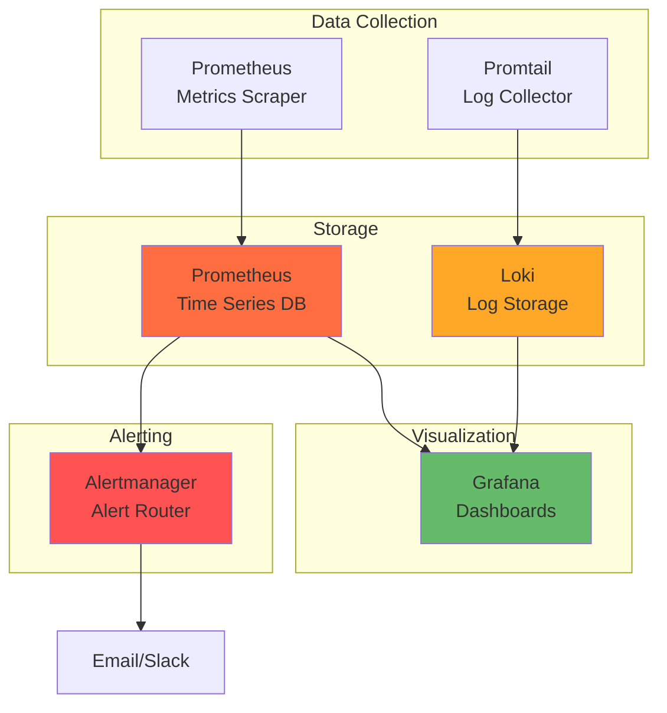

# OPS-PICERL-IDENTIFICATION: Monitoring & Observability

**Document Type:** Operations - PICERL Phase: Identification  
**Version:** 1.0 | **Last Updated:** 2025-12-16  
**Audience:** Operators, SREs, On-Call Engineers

> 👤 **Quick Navigation:**  
> Alerts → [Jump to Alert Rules](#runbook-i2-alert-rules--thresholds)  
> Dashboards → [Jump to Grafana Setup](#runbook-i1-prometheus--grafana-deployment)  
> Logs → [Jump to Log Aggregation](#procedures-log-aggregation)

---

## 📊 At-a-Glance

**Purpose:** Detect issues before they become incidents through monitoring, logging, and observability.

**TL;DR - Monitoring Stack:**

- **Metrics:** Prometheus + Grafana (resource usage, service health)
- **Logs:** Loki + Promtail (centralized logging)
- **Traces:** (Optional) Jaeger for distributed tracing
- **Alerts:** Alertmanager → Email/Slack/PagerDuty



---

## 🚀 Quick Start

### Health Check Checklist

```bash
# 1. Check all pods running
kubectl get pods -A | grep -v Running

# 2. Check Prometheus targets
kubectl port-forward -n monitoring svc/prometheus 9090:9090
# Visit http://localhost:9090/targets

# 3. Check Grafana dashboards
kubectl port-forward -n monitoring svc/grafana 3000:80
# Visit http://localhost:3000 (admin/admin)

# 4. Test alerting
curl -X POST http://prometheus:9090/-/reload
```

---

## 📋 Policy

### 1. Observability-First Policy

**Intent:** Every service must be observable - no blind spots.

**Requirements:**

- All services expose `/metrics` endpoint (Prometheus format)
- All pods log to stdout/stderr (12-factor app)
- Critical services have health/readiness probes
- SLOs defined for user-facing services

### 2. Alert Fatigue Prevention

**Intent:** Alerts must be actionable, not noise.

**Rules:**

- Alert only on symptoms, not causes
- Every alert must have runbook link
- Max 5 alerts/week in steady state
- Silence alerts during maintenance windows

---

## ⚙️ Standards

### Metrics Standards

| Metric Type          | Format                       | Retention |
| -------------------- | ---------------------------- | --------- |
| **Service Metrics**  | Prometheus exposition format | 30 days   |
| **System Metrics**   | Node Exporter                | 30 days   |
| **Application Logs** | JSON to stdout               | 7 days    |
| **Audit Logs**       | Immutable, encrypted         | 1 year    |

### SLO/SLI Standards

| Service            | SLO                     | SLI Metric                |
| ------------------ | ----------------------- | ------------------------- |
| **Home Assistant** | 99% uptime              | `up{job="homeassistant"}` |
| **Jellyfin**       | 95% uptime              | `up{job="jellyfin"}`      |
| **Frigate**        | 99.5% uptime (critical) | `up{job="frigate"}`       |

---

## 💡 Guidelines

### Dashboard Best Practices

**RED Method (Recommended):**

- **R**ate: Requests per second
- **E**rrors: Error rate
- **D**uration: Latency/response time

**USE Method (For resources):**

- **U**tilization: % busy
- **S**aturation: Queue depth
- **E**rrors: Error count

---

## 📖 Procedures

### Runbook I1: Prometheus + Grafana Deployment

```bash
# Install kube-prometheus-stack
helm repo add prometheus-community \
  https://prometheus-community.github.io/helm-charts

helm install kube-prometheus-stack \
  prometheus-community/kube-prometheus-stack \
  --namespace monitoring --create-namespace \
  --values - <<EOF
prometheus:
  prometheusSpec:
    retention: 30d
    storageSpec:
      volumeClaimTemplate:
        spec:
          accessModes: ["ReadWriteOnce"]
          resources:
            requests:
              storage: 50Gi

grafana:
  adminPassword: $(openssl rand -base64 32)
  persistence:
    enabled: true
    size: 10Gi

alertmanager:
  config:
    route:
      receiver: 'email'
    receivers:
    - name: 'email'
      email_configs:
      - to: 'alerts@familyhub.local'
EOF
```

### Runbook I2: Alert Rules & Thresholds

**Create alert rules:**

```yaml
# prometheus-alerts.yaml
apiVersion: monitoring.coreos.com/v1
kind: PrometheusRule
metadata:
  name: familyhub-alerts
  namespace: monitoring
spec:
  groups:
    - name: services
      interval: 30s
      rules:
        - alert: ServiceDown
          expr: up{job=~"homeassistant|jellyfin|frigate"} == 0
          for: 5m
          labels:
            severity: critical
          annotations:
            summary: "Service {{ $labels.job }} is down"
            runbook: "https://docs/OPS-PICERL-ERADICATION.md#service-down"

        - alert: HighMemoryUsage
          expr: (node_memory_MemTotal_bytes - node_memory_MemAvailable_bytes) / node_memory_MemTotal_bytes > 0.9
          for: 10m
          labels:
            severity: warning
          annotations:
            summary: "Memory usage above 90%"
            runbook: "https://docs/OPS-PICERL-ERADICATION.md#high-memory"

        - alert: DiskSpaceLow
          expr: (node_filesystem_avail_bytes / node_filesystem_size_bytes) < 0.1
          for: 5m
          labels:
            severity: critical
          annotations:
            summary: "Disk space below 10% on {{ $labels.device }}"
            runbook: "https://docs/OPS-PICERL-ERADICATION.md#disk-full"
```

### Runbook I3: Grafana Dashboard Setup

**Import Family Hub dashboard:**

```json
{
  "dashboard": {
    "title": "Family Hub Overview",
    "panels": [
      {
        "title": "Service Uptime",
        "type": "stat",
        "targets": [
          {
            "expr": "up{job=~\"homeassistant|jellyfin|frigate\"}"
          }
        ]
      },
      {
        "title": "CPU Usage",
        "type": "graph",
        "targets": [
          {
            "expr": "100 - (avg by(instance) (rate(node_cpu_seconds_total{mode=\"idle\"}[5m])) * 100)"
          }
        ]
      },
      {
        "title": "Memory Usage",
        "type": "graph",
        "targets": [
          {
            "expr": "(node_memory_MemTotal_bytes - node_memory_MemAvailable_bytes) / node_memory_MemTotal_bytes * 100"
          }
        ]
      }
    ]
  }
}
```

---

## 💻 Implementation

### Quick Monitoring Setup

```bash
# Deploy full stack
kubectl apply -f cluster/monitoring/

# Access Grafana
kubectl port-forward -n monitoring svc/grafana 3000:80
# Login: admin / (check secret)
kubectl get secret -n monitoring kube-prometheus-stack-grafana -o jsonpath="{.data.admin-password}" | base64 -d

# Import dashboards
# Kubernetes Cluster: ID 7249
# Node Exporter: ID 1860
```

---

## 📚 Deep Dive

<details>
<summary>Log Aggregation with Loki</summary>

```bash
# Install Loki stack
helm install loki grafana/loki-stack \
  --namespace monitoring \
  --set promtail.enabled=true \
  --set grafana.enabled=false

# Query logs in Grafana
# LogQL: {namespace="homeassistant"} |= "error"
```

</details>

---

**Document Status:** ✅ Complete
