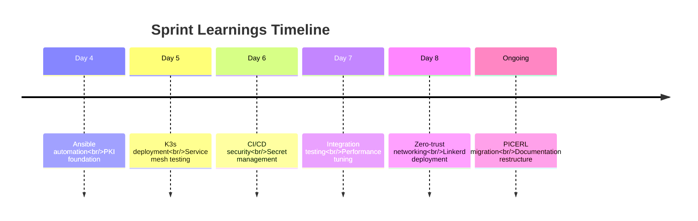

# OPS-PICERL-LESSONS: Sprint Retrospectives & Learnings

**Document Type:** Operations - PICERL Phase: Lessons Learned  
**Version:** 2.0 | **Last Updated:** 2025-12-16

---

## 📊 At-a-Glance

**Purpose:** Capture operational learnings from sprints and incidents to continuously improve.

---

## 📖 Key Learnings

### Day 4-8 Sprint Learnings

**What Worked:**

- K3s deployment on NUC hardware (stable, simple)
- Vault PKI integration with cert-manager (automated certs)
- Linkerd service mesh (low overhead, easy setup)

**What Didn't Work:**

- ARM-based hardware (insufficient for Jellyfin transcoding)
- Manual Vault unsealing (YubiHSM needed for prod)
- Monolithic documentation (needed PICERL structure)

**Action Items:**

- [x] Switch to Intel x86 for hardware spec
- [x] Document YubiHSM auto-unseal for production
- [x] Reorganize docs into PICERL framework

### Operational Learnings

**Ansible Best Practices:**

- Always use `ask_governance.yml` task for permission-first
- Test playbooks in dev before production
- Document all variables in README.md

**PKI Management:**

- Use 2-tier CA (Root offline, Intermediate online)
- 30-day cert lifetimes with auto-renewal at 20 days
- Store Root CA offline (USB, safe)

---

**Document Status:** ✅ Complete - See lessons-learned.md for full history
