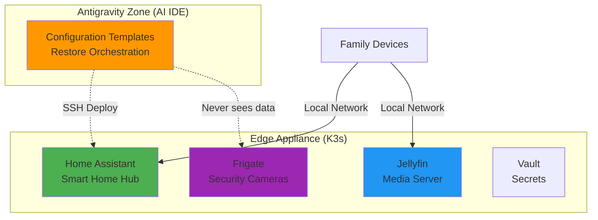
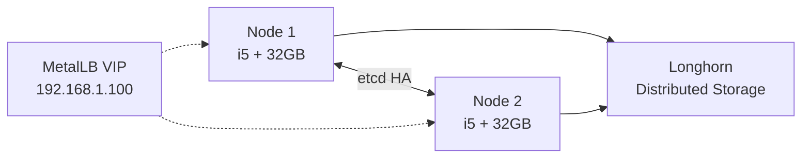

# OPS-PICERL-PREPARATION: Operational Setup & Architecture

**Document Type:** Operations - PICERL Phase: Preparation  
**Version:** 4.0 | **Last Updated:** 2025-12-16  
**Audience:** Operators, DevOps Engineers, System Administrators

> 👤 **Quick Navigation:**  
> Operators → [Jump to Runbooks](#procedures-deployment-runbooks)  
> Management → [Jump to ROI](#policy-cost--roi-requirements)  
> Security → See [SECURITY-PICERL-PREPARATION](SECURITY-PICERL-PREPARATION.md)

---

## 📊 At-a-Glance (30 seconds)

**Purpose:** Define the operational architecture and hardware requirements for deploying the Family Privacy Hub K3s edge appliance.

**TL;DR - Three Key Decisions:**

1. **Hardware Tier:** Most families → Tier 2 ($900, i5, 32GB RAM)
2. **Architecture:** K3s single-node (or dual-node HA for Tier 3)
3. **Service Stack:** Home Assistant + Jellyfin + Frigate NVR (all edge-hosted)



**Critical Constraint:** All user data stays on the edge, encrypted. IDE orchestrates but never decrypts.

---

## 🚀 Quick Start (5 minutes)

### Step 1: Choose Your Hardware Tier

**Decision Tree:**

```
How many concurrent users?
├─ 2-4 users, basic smart home only
│  └─ Tier 1: Intel N100, $400
│
├─ 4-8 users, full stack (media + security)
│  └─ Tier 2: Intel i5, $900 ⭐ RECOMMENDED
│
└─ 8+ users OR need 99.9% uptime
   └─ Tier 3: Dual i5 HA, $1,650
```

| Tier                | CPU   | RAM  | Storage                   | Cost   | Use Case          |
| ------------------- | ----- | ---- | ------------------------- | ------ | ----------------- |
| **1 - Basic**       | N100  | 16GB | 512GB SSD + 4TB HDD       | $400   | Smart home only   |
| **2 - Standard** ⭐ | i5    | 32GB | 512GB + 2TB SSD + 4TB HDD | $900   | Full stack        |
| **3 - Premium**     | 2x i5 | 64GB | HA cluster + NAS          | $1,650 | High availability |

### Step 2: Minimum Viable Setup Checklist

- [ ] **Hardware:** Intel x86 Mini PC (N100 or i5)
- [ ] **OS:** Ubuntu Server 22.04 LTS
- [ ] **Network:** Static IP, SSH access
- [ ] **DNS:** Set to Pi-hole after deployment
- [ ] **Backup:** S3-compatible bucket ready (Backblaze B2)

### Step 3: Common Pitfalls

❌ **Don't:** Use ARM (Raspberry Pi) - Jellyfin needs Intel Quick Sync  
❌ **Don't:** Expose services to internet - use Tailscale VPN instead  
❌ **Don't:** Store backup keys in Git - user-controlled only  
✅ **Do:** Pin K3s version for consistency  
✅ **Do:** Test restore procedure before going live

---

## 📋 Policy (Intent - WHY)

### 1. Privacy Policy

**Intent:** User data never leaves the edge unencrypted.

**Non-Negotiable Principles:**

- All stateful services run on K3s edge appliance
- Backups are client-side encrypted with user-held keys
- AI IDE orchestrates but never decrypts user data
- No telemetry or analytics sent to cloud

### 2. Reliability Policy

**Intent:** 5-year hardware lifespan with self-healing software.

**Principles:**

- K3s automatically restarts crashed pods
- Hardware rated for 24/7 operation
- Virtual Fault Tolerance: OS/software is disposable, data is sacred
- Monthly disaster recovery drills

### 3. Cost & ROI Policy

**Intent:** Pay once, save forever.

**Principle:** Total cost must be recovered within 12 months via subscription savings.

**Target:**

```
Upfront: $900 (Tier 2)
Annual Savings: $1,200 (cloud subscriptions avoided)
Payback: 9 months
```

---

## ⚙️ Standards (Mandatory - MUST)

### Hardware Standards

| Component   | Minimum Requirement           | Rationale                                             |
| ----------- | ----------------------------- | ----------------------------------------------------- |
| **CPU**     | Intel x86 (N100+)             | Jellyfin Quick Sync, Frigate OpenVINO                 |
| **RAM**     | 16GB (Tier 1), 32GB (Tier 2+) | Home Assistant (4GB) + Jellyfin (8GB) + Frigate (8GB) |
| **Storage** | 512GB NVMe SSD                | Fast I/O for K3s and containers                       |
| **Network** | 2.5GbE minimum                | 4K streaming + camera feeds                           |
| **Power**   | <50W TDP                      | Energy efficiency, fanless preferred                  |

### Software Standards

| Component      | Version                       | Requirement                |
| -------------- | ----------------------------- | -------------------------- |
| **OS**         | Ubuntu 22.04 LTS or Debian 12 | Official K3s support       |
| **K3s**        | v1.28.5+                      | Pinned for stability       |
| **Kubernetes** | ≥1.28                         | cert-manager compatibility |
| **Python**     | 3.11+                         | AI Ops Agent requirement   |

### Security Standards

See [SECURITY-PICERL-PREPARATION](SECURITY-PICERL-PREPARATION.md#standards-mandatory-must) for:

- TLS certificate requirements
- Vault PKI standards
- Backup encryption standards

---

## 💡 Guidelines (Best Practices - SHOULD)

### Hardware Selection Guidelines

**Recommended Vendors:**

- **Mini PCs:** Beelink, Minisforum, Intel NUC
- **Storage:** Samsung 970 EVO (NVMe), WD Red (HDD)
- **Network:** UniFi Dream Machine, TP-Link managed switches

**Anti-Patterns to Avoid:**

- ❌ Raspberry Pi (insufficient for Jellyfin 4K)
- ❌ Consumer-grade SD cards (K3s needs SSD)
- ❌ Wi-Fi only (use wired for reliability)

### Service Deployment Guidelines

**Start Small, Scale Up:**

1. Deploy Home Assistant first (validate K3s)
2. Add Jellyfin (test hardware transcoding)
3. Add Frigate (validate storage performance)
4. Add AI services (Ollama/Qdrant) only if needed

**Resource Allocation Recommendations:**

```yaml
# Tier 2 (32GB RAM) - Recommended Limits
homeassistant:
  requests: { memory: 2Gi, cpu: 500m }
  limits: { memory: 4Gi, cpu: 2000m }

jellyfin:
  requests: { memory: 4Gi, cpu: 1000m }
  limits: { memory: 8Gi, cpu: 4000m }

frigate:
  requests: { memory: 4Gi, cpu: 1000m }
  limits: { memory: 8Gi, cpu: 2000m }
```

---

## 📖 Procedures (Deployment Runbooks)

### Runbook 1: Hardware Assembly & BIOS Configuration

**Estimated Time:** 30 minutes

1. **Unbox and inspect** Mini PC, SSD, HDD
2. **Install NVMe SSD** (system drive)
   - Open chassis (usually 2-4 screws)
   - Insert M.2 2280 SSD into slot
   - Secure with mounting screw
3. **Install 2.5" SSD/HDD** (data drives)
   - Connect SATA data + power cables
   - Mount in drive bay
4. **Boot to BIOS** (F2 or DEL on power-on)
   - Enable: VT-x / AMD-V (virtualization)
   - Enable: VT-d / AMD IOMMU (if available)
   - Disable: Secure Boot
   - Set: Boot order (NVMe first)
5. **Save and exit**

**Validation:**

```bash
# After OS install, verify virtualization
egrep -o '(vmx|svm)' /proc/cpuinfo
# Should return "vmx" (Intel) or "svm" (AMD)
```

---

### Runbook 2: Ubuntu Server Installation

**Estimated Time:** 20 minutes

1. **Prepare USB installer**

   - Download: Ubuntu Server 22.04 LTS ISO
   - Flash to USB: `dd if=ubuntu.iso of=/dev/sdX bs=4M`

2. **Boot from USB** and follow installer:

   - Language: English
   - Network: Configure static IP
     ```
     IP: 192.168.1.10/24
     Gateway: 192.168.1.1
     DNS: 1.1.1.1, 8.8.8.8 (temp, will use Pi-hole later)
     ```
   - Storage: Use entire NVMe SSD
   - Profile: Create admin user
   - SSH: Enable OpenSSH server
   - Packages: None (install via K3s later)

3. **First boot configuration:**

   ```bash
   # Update system
   sudo apt update && sudo apt upgrade -y

   # Install essentials
   sudo apt install -y curl wget git vim htop

   # Disable swap (required for K3s)
   sudo swapoff -a
   sudo sed -i '/ swap / s/^/#/' /etc/fstab

   # Configure kernel parameters
   cat <<EOF | sudo tee /etc/sysctl.d/99-k3s.conf
   net.bridge.bridge-nf-call-iptables=1
   net.bridge.bridge-nf-call-ip6tables=1
   net.ipv4.ip_forward=1
   EOF
   sudo sysctl --system

   # Reboot
   sudo reboot
   ```

**Validation:**

```bash
free -h  # Swap should show 0
sysctl net.ipv4.ip_forward  # Should return 1
```

---

### Runbook 3: K3s Installation

**Estimated Time:** 15 minutes

**Prerequisites:**

- Ubuntu installed
- Static IP configured
- SSH access working

**Procedure:**

```bash
# Set K3s version (pin for stability)
export INSTALL_K3S_VERSION="v1.28.5+k3s1"
export K3S_TOKEN=$(openssl rand -hex 32)

# Install K3s server
curl -sfL https://get.k3s.io | sh -s - server \
  --cluster-init \
  --data-dir=/var/lib/rancher/k3s \
  --disable traefik \
  --disable servicelb \
  --write-kubeconfig-mode=644 \
  --token="${K3S_TOKEN}"

# Wait for K3s to be ready (2-3 minutes)
sudo systemctl status k3s

# Verify cluster
sudo kubectl get nodes
# Should show: familyhub Ready control-plane 1m v1.28.5+k3s1
```

**Validation:**

```bash
# Check all system pods running
sudo kubectl get pods -A

# Should see:
# NAMESPACE   NAME                      READY   STATUS
# kube-system coredns-xxx              1/1     Running
# kube-system local-path-provisioner   1/1     Running
# kube-system metrics-server           1/1     Running
```

<details>
<summary>🔍 Troubleshooting: K3s won't start</summary>

**Common Issues:**

1. **Port conflict (6443 already in use):**

   ```bash
   sudo lsof -i :6443
   # Kill conflicting process or use different port
   ```

2. **Insufficient memory:**

   ```bash
   free -h
   # Need at least 2GB free for K3s
   ```

3. **Firewall blocking:**
   ```bash
   sudo ufw allow 6443/tcp
   sudo ufw allow 10250/tcp
   ```

**Full reset (if needed):**

```bash
sudo /usr/local/bin/k3s-uninstall.sh
# Then re-run installation
```

</details>

---

### Runbook 4: Deploy MetalLB (LoadBalancer)

**Purpose:** Provide external IPs for services within the cluster

```bash
# Install MetalLB
kubectl apply -f https://raw.githubusercontent.com/metallb/metallb/v0.13.12/config/manifests/metallb-native.yaml

# Wait for pods
kubectl wait --namespace metallb-system \
  --for=condition=ready pod \
  --selector=app=metallb \
  --timeout=90s

# Configure IP pool (adjust for your network)
cat <<EOF | kubectl apply -f -
apiVersion: metallb.io/v1beta1
kind: IPAddressPool
metadata:
  name: default-pool
  namespace: metallb-system
spec:
  addresses:
  - 192.168.1.100-192.168.1.110
---
apiVersion: metallb.io/v1beta1
kind: L2Advertisement
metadata:
  name: default
  namespace: metallb-system
spec:
  ipAddressPools:
  - default-pool
EOF
```

**Validation:**

```bash
kubectl get ipaddresspool -n metallb-system
# Should show: default-pool with your IP range
```

---

## 💻 Implementation (Execution - DO)

### Service Stack Installation

After K3s and MetalLB are ready, deploy services in order:

1. **Foundation Services:**

   ```bash
   # cert-manager (TLS automation)
   kubectl apply -f https://github.com/cert-manager/cert-manager/releases/download/v1.13.3/cert-manager.yaml

   # Longhorn (optional, for HA storage)
   kubectl apply -f https://raw.githubusercontent.com/longhorn/longhorn/v1.5.3/deploy/longhorn.yaml
   ```

2. **Core Applications:**

   ```bash
   # Home Assistant
   helm repo add home-assistant https://pajikos.github.io/home-assistant-helm-chart/
   helm install homeassistant home-assistant/home-assistant \
     --set persistence.enabled=true \
     --set ingress.enabled=true

   # Jellyfin (see cluster/ai-ops-agent/deployment/jellyfin.yaml)
   kubectl apply -f cluster/ai-ops-agent/deployment/jellyfin.yaml

   # Frigate (optional)
   kubectl apply -f cluster/ai-ops-agent/deployment/frigate.yaml
   ```

3. **Monitoring:**
   ```bash
   # Prometheus + Grafana
   helm repo add prometheus-community https://prometheus-community.github.io/helm-charts
   helm install kube-prometheus-stack prometheus-community/kube-prometheus-stack \
     --namespace monitoring --create-namespace
   ```

---

## 📚 Deep Dive (Advanced Topics)

<details>
<summary>Why Intel x86 instead of ARM?</summary>

**Jellyfin Hardware Transcoding:**

- Jellyfin requires Intel Quick Sync for efficient 4K transcoding
- ARM (Raspberry Pi) lacks hardware acceleration → 100% CPU usage
- Intel N100 can handle 3-5 concurrent 4K streams at <15W power

**Frigate AI Acceleration:**

- Frigate uses OpenVINO for object detection
- Intel iGPU provides 10x faster inference vs CPU-only
- Alternative: Google Coral TPU (USB) but less integrated

**Benchmark:**

```
4K HEVC → 1080p H.264 transcode:
- Raspberry Pi 4: 2 FPS (unusable)
- Intel N100 (Quick Sync): 60+ FPS (real-time)
```

</details>

<details>
<summary>High Availability Architecture (Tier 3)</summary>

**Dual-Node K3s Cluster:**



**Setup:**

```bash
# Node 1 (primary)
curl -sfL https://get.k3s.io | sh -s - server \
  --cluster-init \
  --token=${K3S_TOKEN}

# Node 2 (join)
curl -sfL https://get.k3s.io | sh -s - server \
  --server=https://192.168.1.11:6443 \
  --token=${K3S_TOKEN}
```

**Benefits:**

- 99.9% uptime (survives single node failure)
- Automatic pod failover
- Distributed storage (Longhorn)

**Cost:** +$500 (second Mini PC) + $200 (NAS)

</details>

---

## 🔗 Cross-References

**Next Steps:**

- **Deployment:** [OPS-PICERL-RECOVERY](OPS-PICERL-RECOVERY.md) - Restore Protocol & DR
- **Security:** [SECURITY-PICERL-PREPARATION](SECURITY-PICERL-PREPARATION.md) - Hardening & zero-trust

**Supporting Docs:**

- Hardware Assembly: [ARCHIVE/FAMILY-SERVICES-APPLIANCE-ASSEMBLY.md](ARCHIVE/FAMILY-SERVICES-APPLIANCE-ASSEMBLY.md)
- Business Case: [BUSINESS/BUSINESS-MODEL.md](BUSINESS/BUSINESS-MODEL.md)

---

**Document Status:** ✅ Complete - Ready for deployment

**Document Type:** Operations - PICERL Phase: Preparation  
**Version:** 3.0 | **Last Updated:** 2025-12-16  
**Purpose:** Master operational design document for Family Privacy Hub appliance setup

> [!IMPORTANT]
> This document consolidates all preparation materials needed BEFORE deployment. It defines the architecture, hardware specifications, and initial setup procedures for the K3s edge appliance.

---

## 1. Product Vision & Architecture Philosophy

### Value Proposition

**Family Privacy Hub** is a privacy-first home automation appliance that replaces expensive cloud subscriptions ($1,200+/year) with local control - giving families ownership of their smart home, media, and security without recurring costs.

**Tagline:** _"Your Smart Home, Your Data, Your Control - Forever."_

### The Antigravity Architecture

The system uses a **Hub-and-Spoke** architecture with strict separation between physical state and weightless knowledge:

**Gravity Zone (Physical Edge - K3s):**

- K3s appliance on 5-year hardware lifespan
- Runs ALL stateful workloads (Ollama, Qdrant, Home Assistant, Jellyfin, Frigate)
- Data never leaves unencrypted
- Self-healing (K3s restarts failed pods)

**Antigravity Zone (AI IDE):**

- Holds configuration templates and deployment recipes
- Orchestrates disaster recovery via SSH
- Never sees unencrypted data or decryption keys
- Weightless, stateless, always available

---

## 2. Hardware Architecture

### Hardware Philosophy

**Intel x86 Required** for Jellyfin Quick Sync and Frigate OpenVINO AI acceleration.

### Tier 1: Basic Home Hub ($350-400)

**Target:** Small families, smart home only

| Component    | Specification                       |
| ------------ | ----------------------------------- |
| **Platform** | Intel N100 Mini PC                  |
| **CPU**      | Intel N100 (4-core, 3.4GHz, 6W TDP) |
| **RAM**      | 16GB DDR4/DDR5                      |
| **Storage**  | 512GB NVMe SSD + 4TB HDD            |
| **Network**  | Dual 2.5GbE                         |
| **Power**    | 10-15W typical                      |

**Services:**

- Home Assistant
- Jellyfin (1-2 concurrent 1080p streams)
- DNS/DHCP (Pi-hole)
- Dashboard

**Performance:**

- Users: 2-4 concurrent
- Uptime: 95%+

---

### Tier 2: Standard Complete Hub ⭐ RECOMMENDED ($850-900)

**Target:** Medium families, full service stack

| Component    | Specification                                             |
| ------------ | --------------------------------------------------------- |
| **Platform** | Intel i5-12400 or i5-13400 Mini PC                        |
| **CPU**      | Intel i5 (6P+4E cores, up to 4.4GHz)                      |
| **RAM**      | 32GB DDR4                                                 |
| **Storage**  | 512GB NVMe (system) + 2TB SSD (Frigate) + 4TB HDD (media) |
| **Network**  | Dual 2.5GbE                                               |
| **Power**    | 25-30W typical                                            |

**Services:**

- Home Assistant
- Jellyfin (3-5 concurrent 4K transcodes)
- Frigate NVR (4-6 cameras)
- All supporting services

**Performance:**

- Users: 4-8 concurrent
- Jellyfin: 3-5x 4K streams
- Frigate: 4-6 cameras with AI detection
- Uptime: 99%+

**Cost Breakdown:**

```
Intel i5 Mini PC (32GB/512GB)    : $450-500
2TB NVMe SSD (Frigate storage)   : $150-180
4TB HDD (media storage)          : $80-100
PoE switch (for cameras)         : $70-90
Accessories                      : $30-50
─────────────────────────────────
TOTAL (without cameras)          : $850-900

Optional: 4x IP Cameras          : +$200-400
TOTAL (with cameras)             : $1,050-1,300

*Prices as of December 2024, subject to market changes
```

---

### Tier 3: Premium High Availability ($1,400-1,900)

**Target:** Large families, HA required

**Option A: Dual Intel i5 (High Availability)**

- 2× Intel i5-12400 Mini PC
- k3s dual-node cluster with automatic failover
- Shared NAS storage (Longhorn/NFS)
- 2.5GbE/10GbE switch
- UPS (1500VA) for clean shutdowns

**Performance:**

- Users: 8-15+ concurrent
- Uptime: 99.9%+ with HA

---

## 3. Service Stack (Edge Services)

All services run on K3s at the physical edge.

### Core Services

| Service            | Purpose           | Resource Requirements                 | Priority   |
| ------------------ | ----------------- | ------------------------------------- | ---------- |
| **Home Assistant** | Smart home hub    | 2-4GB RAM, 10-20GB storage            | #1         |
| **Jellyfin**       | Media server      | 4-8GB RAM, 4TB HDD, Intel Quick Sync  | #2         |
| **Frigate NVR**    | Security cameras  | 4-8GB RAM, 2TB SSD, AI accelerator    | #3         |
| **Pi-hole**        | DNS/Ad-blocking   | 256MB RAM, network-wide               | Supporting |
| **cert-manager**   | TLS automation    | Auto-renewing certificates            | Supporting |
| **Restic**         | Encrypted backups | S3-compatible, client-side encryption | Supporting |
| **Homepage**       | Unified dashboard | Landing page at `home.lan`            | Supporting |

### AI/LLM Services (Optional - Advanced Users)

| Service    | Purpose             | Resource Requirements           |
| ---------- | ------------------- | ------------------------------- |
| **Ollama** | Local LLM inference | 8-16GB RAM, NVIDIA GPU optional |
| **Qdrant** | Vector database     | 2-4GB RAM, NVMe SSD             |

---

## 4. Network Architecture

### DNS Strategy

- **External DNS:** Pi-hole for ad-blocking
- **Internal DNS:** CoreDNS (K3s) for service discovery
- **Domain:** `*.home.lan` (internal only)

### Service Access URLs

```
https://home.lan                 → Dashboard (Homepage)
https://homeassistant.home.lan   → Home Assistant
https://media.home.lan           → Jellyfin
https://security.home.lan        → Frigate NVR
```

### Network Segmentation (Recommended)

- **Management VLAN:** Appliance admin
- **IoT VLAN:** Smart home devices
- **Camera VLAN:** Security cameras (isolated)
- **Family VLAN:** User devices

---

## 5. Storage Architecture

### System Storage (512GB NVMe SSD)

```
OS and k3s:             50GB
Container images:       20-30GB
Home Assistant config:  10-20GB
Logs and metrics:       10-20GB
Headroom:               400GB+
```

### Frigate Storage (2TB SSD)

```
24/7 recording:      150GB per camera per week
4 cameras:           ~600GB/week
Retention:           2-3 weeks with 2TB
```

### Media Storage (4TB HDD)

```
Movies (1080p):      ~1,000 movies at 4GB each
TV Shows:            50-100 full seasons
Music library:       50,000+ songs
Photos:              100,000+ high-res photos
```

### Backup Strategy

- **Local:** USB external drive (weekly full backup)
- **Cloud:** Backblaze B2 (encrypted incremental, user-controlled keys)
- **Testing:** Monthly restore validation

---

## 6. Compute Resource Allocation

**Tier 2 (Standard) Resource Plan:**

```
Total RAM: 32GB
├─ k3s overhead: 2GB
├─ Home Assistant: 4GB
├─ Jellyfin: 8GB (transcoding)
├─ Frigate: 8GB (AI + recording)
├─ Pi-hole: 256MB
├─ Dashboard: 256MB
├─ Monitoring: 2GB (Prometheus/Grafana)
└─ Available: 7.5GB (buffer)

Total Storage:
├─ System: 512GB NVMe (fast I/O)
├─ Frigate: 2TB SSD (high IOPS)
└─ Media: 4TB HDD (cost-effective)

Total Network:
└─ 2.5GbE sufficient for 4-6 cameras + media streaming
```

---

## 7. K3s Cluster Configuration

### Single Node (Tier 1, Tier 2)

```yaml
k3s server:
  - Control plane + workload
  - Embedded etcd (single-node)
  - Local storage (local-path provisioner)
  - MetalLB for LoadBalancer IPs
```

### Dual Node HA (Tier 3)

```yaml
k3s cluster:
  - 2× server nodes (HA control plane)
  - Embedded etcd with HA
  - Distributed storage (Longhorn or NFS)
  - MetalLB for VIP failover
  - Automatic pod failover
```

---

## 8. Initial Setup Checklist

See [OPS-PICERL-RECOVERY](OPS-PICERL-RECOVERY.md) for detailed deployment procedures.

### Phase 1: Hardware Assembly

- [ ] Assemble Mini PC
- [ ] Install NVMe SSD and HDD
- [ ] Connect to network via 2.5GbE
- [ ] Configure BIOS (enable VT-x, disable secure boot)

### Phase 2: Base OS Installation

- [ ] Install Ubuntu Server 22.04 LTS
- [ ] Set static IP address
- [ ] Configure SSH keys
- [ ] Disable swap
- [ ] Configure kernel parameters

### Phase 3: K3s Deployment

- [ ] Install K3s server
- [ ] Verify cluster status
- [ ] Deploy MetalLB
- [ ] Deploy cert-manager
- [ ] Create internal CA

### Phase 4: Foundation Services

- [ ] Deploy Pi-hole
- [ ] Deploy Longhorn (if HA)
- [ ] Deploy Prometheus/Grafana monitoring
- [ ] Configure backup (Restic)

### Phase 5: Application Services

- [ ] Deploy Home Assistant
- [ ] Deploy Jellyfin (with hardware transcoding)
- [ ] Deploy Frigate NVR (optional)
- [ ] Deploy Dashboard

---

## 9. Security Architecture

### Security Layers

**Layer 1: Network Security**

- Firewall: UFW or iptables
- VLANs: IoT/Camera isolation
- No external exposure (internal only)
- VPN: Tailscale or WireGuard for remote access

**Layer 2: TLS/Encryption**

- Internal CA (self-signed certificates)
- TLS for all web interfaces
- Encrypted backup (Restic with user-controlled keys)

**Layer 3: Access Control**

- Home Assistant: User authentication
- Jellyfin: Multi-user with permissions
- Frigate: Authentication required

**Layer 4: System Hardening**

- Minimal attack surface
- Regular security updates (unattended-upgrades)
- Audit logging (systemd journal)

**Layer 5: Governance & Compliance**

- AIOps/Sec Governance Service integration
- Policy validation before deployments
- See [SECURITY-PICERL-PREPARATION](SECURITY-PICERL-PREPARATION.md)

---

## 10. Cost Analysis & ROI

### Hardware Cost Summary

| Tier             | Hardware     | Total  | $/User\* |
| ---------------- | ------------ | ------ | -------- |
| **Basic**        | $350-400     | $400   | $100-133 |
| **Standard**     | $850-900     | $900   | $113-150 |
| **Premium (HA)** | $1,400-1,900 | $1,650 | $110-183 |

\*Based on midpoint target users

### ROI Calculation (Tier 2 - Standard)

**Cloud Equivalent Costs (Annual):**

```
Google Nest Aware (4 cameras):   $720/year
Ring Protect Plus:                $200/year
Plex Pass:                        $120/year
─────────────────────────────────
Total Annual Subscriptions:       $1,040-1,200/year
```

**Savings:**

```
Upfront Cost:                $900
Annual Subscription Savings: $1,200/year
───────────────────────────────
Payback Period:              9 months
3-Year Total Savings:        $2,700
5-Year Total Savings:        $5,100
```

**Key Message:** _Privacy Hub pays for itself in < 12 months, then saves $1200+/year forever._

---

## 11. References & Next Steps

### Next Phase

- **Deployment:** See [OPS-PICERL-RECOVERY](OPS-PICERL-RECOVERY.md) for installation runbooks
- **Security:** See [SECURITY-PICERL-PREPARATION](SECURITY-PICERL-PREPARATION.md) for hardening

### Supporting Documentation

- Hardware BOM: [FAMILY-SERVICES-APPLIANCE-BOM](ARCHIVE/FAMILY-SERVICES-APPLIANCE-BOM.md)
- Assembly Guide: [FAMILY-SERVICES-APPLIANCE-ASSEMBLY](ARCHIVE/FAMILY-SERVICES-APPLIANCE-ASSEMBLY.md)
- Business Model: [BUSINESS/BUSINESS-MODEL.md](BUSINESS/BUSINESS-MODEL.md)

---

**Document Status:** ✅ Complete - Ready for deployment phase
