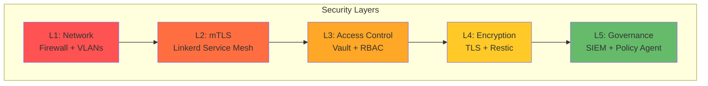

# SECURITY-PICERL-PREPARATION: Security Hardening & Zero-Trust

**Document Type:** Security - PICERL Phase: Preparation  
**Version:** 1.0 | **Last Updated:** 2025-12-16  
**Audience:** Security Engineers, System Administrators, Compliance Officers

> 👤 **Quick Navigation:**  
> Operators → See [OPS-PICERL-PREPARATION](OPS-PICERL-PREPARATION.md)  
> Security → [Jump to Standards](#standards-mandatory-must)  
> Compliance → [Jump to Policy](#policy-intent---why)

---

## 📊 At-a-Glance (30 seconds)

**Purpose:** Define security hardening requirements for the Family Privacy Hub appliance BEFORE deployment.

**TL;DR - Three Security Pillars:**

1. **Zero-Trust Networking:** mTLS via Linkerd + default-deny network policies
2. **Secret Management:** Vault PKI with user-controlled root keys
3. **Blind Backups:** Client-side encryption, decryption keys never leave edge



**Critical Principle:** Defense in depth - every layer assumes the previous layer is compromised.

---

## 🚀 Quick Start (5 minutes)

### Security Readiness Checklist

**Before first boot:**

- [ ] **Firewall:** UFW installed, default deny ingress
- [ ] **SSH:** Key-based auth only, password auth disabled
- [ ] **Vault:** Root token secured offline (USB key)
- [ ] **Backup Key:** User-generated, never committed to Git
- [ ] **Network:** IoT/Camera VLANs configured

### Common Security Pitfalls

❌ **Don't:** Store Vault root token in environment variables  
❌ **Don't:** Expose K3s API (6443) to internet  
❌ **Don't:** Skip TLS for internal services  
❌ **Don't:** Use same backup key across appliances  
✅ **Do:** Test disaster recovery with encrypted backups  
✅ **Do:** Enable audit logging on Vault  
✅ **Do:** Rotate certificates every 30 days (automatic via cert-manager)

---

## 📋 Policy (Intent - WHY)

### 1. Privacy-First Policy

**Intent:** User data never leaves the edge in plaintext.

**Principles:**

- All stateful workloads run on edge K3s appliance
- Backups encrypted with user-controlled keys (never escrowed)
- AI IDE orchestrates but never decrypts
- Zero telemetry to cloud

**Enforcement:**

- Restic backup requires local key file (not in Git)
- Network policies block egress except Tailscale VPN
- Vault root token stored offline

### 2. Zero-Trust Policy

**Intent:** Assume breach - every service authenticates mutually.

**Principles:**

- No implicit trust between pods
- mTLS for all TCP traffic
- Default-deny network policies
- Least privilege RBAC

**Enforcement:**

- Linkerd service mesh (automatic mTLS)
- Network policies: `default-deny-all` + explicit allows
- Vault Service Accounts with scoped policies

### 3. Compliance Policy

**Intent:** Meet enterprise security standards despite consumer hardware.

**Principles:**

- Security controls as code (GitOps)
- Automated policy validation (SIEM emitters)
- Audit logging enabled
- Monthly security reviews

**Enforcement:**

- See [OPS-PICERL-ERADICATION](OPS-PICERL-ERADICATION.md) for governance integration

---

## ⚙️ Standards (Mandatory - MUST)

### TLS/PKI Standards

| Component           | Requirement                                     | Validation                   |
| ------------------- | ----------------------------------------------- | ---------------------------- |
| **Root CA**         | 4096-bit RSA, 10-year lifetime, offline storage | `vault read pki/cert/ca`     |
| **Intermediate CA** | 2048-bit RSA, 5-year lifetime, auto-renew       | `vault read pki_int/cert/ca` |
| **Service Certs**   | 30-day lifetime, auto-renew at 20 days          | `kubectl get certificate -A` |
| **TLS Version**     | ≥ TLS 1.2 (prefer TLS 1.3)                      | `openssl s_client -connect`  |

### Secret Management Standards

| Standard              | Requirement                                     | Enforcement                 |
| --------------------- | ----------------------------------------------- | --------------------------- |
| **Vault Seal**        | Auto-unseal with YubiHSM (prod) or manual (dev) | SystemD service             |
| **Secret Rotation**   | Every 90 days minimum                           | Vault TTL policies          |
| **Backup Encryption** | AES-256, user-controlled key                    | Restic `--password-file`    |
| **Git Secrets**       | NEVER commit secrets                            | Pre-commit hooks (gitleaks) |

### Network Security Standards

| Standard             | Requirement                    | Validation                     |
| -------------------- | ------------------------------ | ------------------------------ |
| **Firewall**         | UFW enabled, default deny      | `ufw status`                   |
| **SSH**              | Key-based only, no passwords   | `/etc/ssh/sshd_config`         |
| **Service Mesh**     | Linkerd mTLS for all TCP       | `linkerd viz tap`              |
| **Network Policies** | Default deny + explicit allows | `kubectl get networkpolicy -A` |

---

## 💡 Guidelines (Best Practices - SHOULD)

### Recommended Security Hardening

**OS Level:**

- Enable automatic security updates: `unattended-upgrades`
- Disable unnecessary services: `systemctl disable bluetooth`
- Enable audit logging: `auditd` with Vault integration
- Set strict file permissions: `chmod 600 ~/.kube/config`

**Kubernetes Level:**

```yaml
# Recommended PodSecurityPolicy (replace with Pod Security Standards in K8s 1.25+)
apiVersion: policy/v1beta1
kind: PodSecurityPolicy
metadata:
  name: restricted
spec:
  privileged: false
  allowPrivilegeEscalation: false
  runAsNonRoot: true
  seLinux:
    rule: RunAsAny
  supplementalGroups:
    rule: RunAsAny
  fsGroup:
    rule: RunAsAny
```

### Certificate Rotation Strategy

**Automated (Recommended):**

- cert-manager watches for cert expiry (renewBefore: 20 days)
- Vault issues new cert automatically
- Pods restart to pick up new cert

**Manual (Disaster Recovery):**

```bash
# Force cert renewal
cmctl renew homeassistant-tls -n homeassistant

# Rotate Vault intermediate CA
vault write -f pki_int/intermediate/generate/internal
```

---

## 📖 Procedures (Security Runbooks)

### Runbook S1: Vault Initialization & Hardening

**Estimated Time:** 20 minutes

1. **Initialize Vault** (first time only):

   ```bash
   vault operator init -key-shares=5 -key-threshold=3

   # Save output to SECURE LOCATION (USB key, password manager)
   # NEVER commit to Git!
   ```

2. **Unseal Vault:**

   ```bash
   vault operator unseal <key1>
   vault operator unseal <key2>
   vault operator unseal <key3>
   # (3 of 5 keys required)
   ```

3. **Enable audit logging:**

   ```bash
   vault audit enable file file_path=/var/log/vault/audit.log
   ```

4. **Create PKI secret engine:**

   ```bash
   # Root CA (offline, 10-year)
   vault secrets enable -path=pki pki
   vault secrets tune -max-lease-ttl=87600h pki

   vault write -field=certificate pki/root/generate/internal \
     common_name="Family Hub Root CA" \
     ttl=87600h > CA_cert.crt

   # Intermediate CA (online, 5-year)
   vault secrets enable -path=pki_int pki
   vault secrets tune -max-lease-ttl=43800h pki_int

   vault write -format=json pki_int/intermediate/generate/internal \
     common_name="Family Hub Intermediate CA" \
     | jq -r '.data.csr' > pki_intermediate.csr

   vault write -format=json pki/root/sign-intermediate \
     csr=@pki_intermediate.csr \
     format=pem_bundle ttl="43800h" \
     | jq -r '.data.certificate' > intermediate.cert.pem

   vault write pki_int/intermediate/set-signed \
     certificate=@intermediate.cert.pem
   ```

**Validation:**

```bash
vault read pki/cert/ca  # Should show Root CA
vault read pki_int/cert/ca  # Should show Intermediate CA signed by Root
```

---

### Runbook S2: Linkerd Service Mesh Deployment

**Purpose:** Enable zero-trust mTLS between all services

1. **Install Linkerd CLI:**

   ```bash
   curl --proto '=https' --tlsv1.2 -sSfL https://run.linkerd.io/install | sh
   export PATH=$PATH:~/.linkerd2/bin
   ```

2. **Verify cluster compatibility:**

   ```bash
   linkerd check --pre
   # All checks should pass
   ```

3. **Install Linkerd control plane:**

   ```bash
   # Generate trust anchor (use Vault-issued cert in production)
   step certificate create root.linkerd.cluster.local ca.crt ca.key \
     --profile root-ca --no-password --insecure

   # Install Linkerd
   linkerd install \
     --identity-trust-anchors-file ca.crt \
     --identity-issuer-certificate-file ca.crt \
     --identity-issuer-key-file ca.key \
     | kubectl apply -f -

   # Wait for control plane
   linkerd check
   ```

4. **Inject sidecars into namespaces:**

   ```bash
   # Annotate namespaces for auto-injection
   kubectl annotate namespace homeassist linkerd.io/inject=enabled
   kubectl annotate namespace jellyfin linkerd.io/inject=enabled

   # Restart pods to inject sidecars
   kubectl rollout restart deployment -n homeassistant
   kubectl rollout restart deployment -n jellyfin
   ```

**Validation:**

```bash
# Check mTLS is active
linkerd viz tap deployment/homeassistant -n homeassistant
# Should show: tls=true for all connections

# Check service mesh coverage
linkerd viz stat deployment -n homeassistant
# Should show: MESHED 100%
```

---

### Runbook S3: Network Policies (Default Deny)

**Purpose:** Block all traffic except explicitly allowed

1. **Create base default-deny policy:**

   ```yaml
   # 00-default-deny.yaml
   apiVersion: networking.k8s.io/v1
   kind: NetworkPolicy
   metadata:
     name: default-deny-all
     namespace: homeassistant
   spec:
     podSelector: {}
     policyTypes:
       - Ingress
       - Egress
   ```

2. **Allow DNS (required):**

   ```yaml
   # 01-allow-dns.yaml
   apiVersion: networking.k8s.io/v1
   kind: NetworkPolicy
   metadata:
     name: allow-dns
     namespace: homeassistant
   spec:
     podSelector: {}
     policyTypes:
       - Egress
     egress:
       - to:
           - namespaceSelector:
               matchLabels:
                 name: kube-system
         ports:
           - protocol: UDP
             port: 53
   ```

3. **Allow specific service communication:**

   ```yaml
   # 02-allow-ha-to-vault.yaml
   apiVersion: networking.k8s.io/v1
   kind: NetworkPolicy
   metadata:
     name: allow-homeassistant-to-vault
     namespace: homeassistant
   spec:
     podSelector:
       matchLabels:
         app: homeassistant
     policyTypes:
       - Egress
     egress:
       - to:
           - namespaceSelector:
               matchLabels:
                 name: vault
         ports:
           - protocol: TCP
             port: 8200
   ```

4. **Apply and test:**

   ```bash
   kubectl apply -f network-policies/

   # Test: This should FAIL (egress blocked)
   kubectl run -it --rm debug --image=busybox -- wget -O- google.com

   # Test: This should SUCCEED (DNS allowed)
   kubectl run -it --rm debug --image=busybox -- nslookup kubernetes.default
   ```

---

## 💻 Implementation (Execution - DO)

### Complete Security Hardening Sequence

After base OPS-PREPARATION is complete, run in order:

```bash
# 1. Vault setup
cd cluster/foundation/vault
./init-vault.sh
./configure-pki.sh

# 2. Linkerd service mesh
cd cluster/foundation/linkerd
./deploy.sh

# 3. Network policies
kubectl apply -f cluster/foundation/network-policies/

# 4. SIEM + Governance (optional)
kubectl apply -f docs/DESIGN-v2-GOVERNANCE.md  # See governance design

# 5. Validate
./verify-security-posture.sh
```

---

## 📚 Deep Dive (Advanced Topics)

<details>
<summary>Why Linkerd over Istio?</summary>

**Resource Comparison:**

| Mesh        | Control Plane RAM | Data Plane (per pod) | Latency Impact |
| ----------- | ----------------- | -------------------- | -------------- |
| **Linkerd** | ~200MB            | ~10MB (Rust proxy)   | <1ms           |
| **Istio**   | ~1GB              | ~50MB (Envoy)        | 1-5ms          |

**For edge appliances with 32GB RAM total:**

- Linkerd: 200MB control + (10MB × 20 pods) = 400MB (~1.2% RAM)
- Istio: 1GB control + (50MB × 20 pods) = 2GB (~6% RAM)

**Verdict:** Linker

d's footprint is 5x smaller - critical for resource-constrained edge.

</details>

<details>
<summary>Backup Encryption Key Management</summary>

**User-Controlled Key Generation:**

```bash
# User generates backup key (NEVER done by IDE)
restic-backup-key=$(openssl rand -base64 32)

# Store securely (choose ONE):
# Option 1: Password manager (1Password, Bitwarden)
# Option 2: USB key (encrypted USB drive)
# Option 3: Print and store in safe

# Configure Restic
cat <<EOF > /etc/restic/password.txt
$restic-backup-key
EOF
chmod 600 /etc/restic/password.txt

# Test backup
restic -r s3:backup-bucket init --password-file /etc/restic/password.txt
```

**IDE Restore Flow (Privacy-Preserving):**

1. IDE generates K3s skeleton (structure only)
2. IDE prompts: "Enter your backup key"
3. User provides key via local SSH paste (NEVER sent to IDE)
4. IDE runs `restic restore` ON the appliance (key never leaves edge)

**Key Point:** IDE coordinates, user controls decryption keys.

</details>

---

## 🔗 Cross-References

**Next Steps:**

- **Incident Response:** [SECURITY-PICERL-IDENTIFICATION](SECURITY-PICERL-IDENTIFICATION.md)
- **Operations:** [OPS-PICERL-PREPARATION](OPS-PICERL-PREPARATION.md)

**Related Docs:**

- Governance Integration: [DESIGN-v2-GOVERNANCE](DESIGN-v2-GOVERNANCE.md)
- Antigravity Architecture: [ANTIGRAVITY-ARCHITECTURE](ANTIGRAVITY-ARCHITECTURE.md)

---

**Document Status:** ✅ Complete - Ready for security hardening
